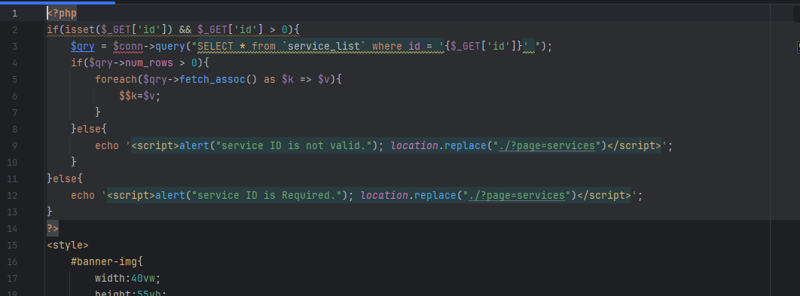
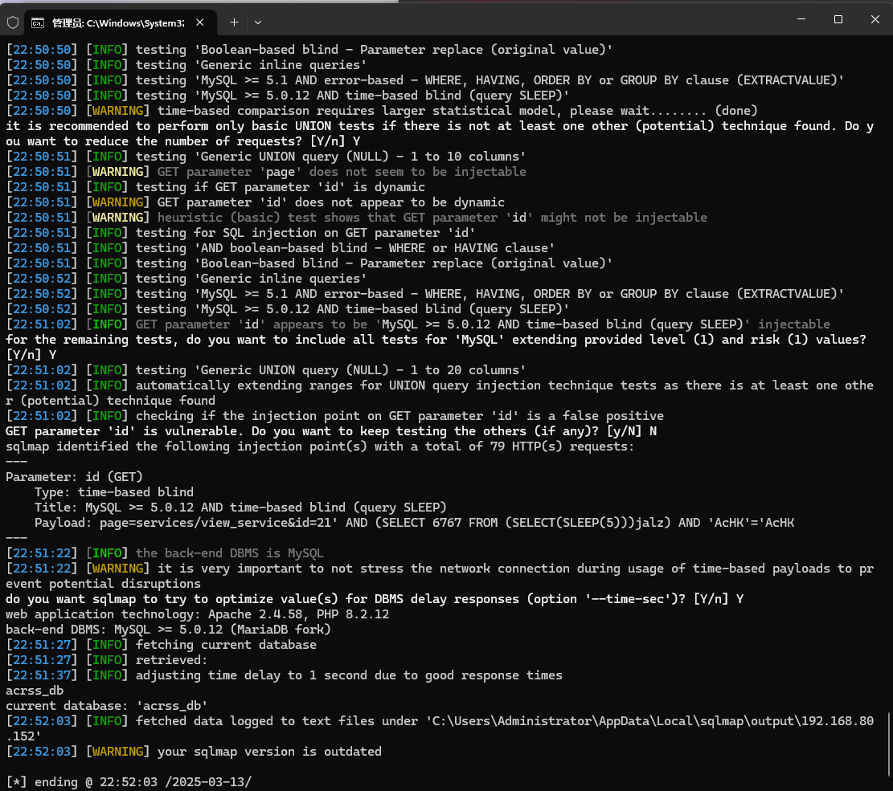

AC Repair and Services System using SQL injection vulnerabilities can be exploited by attackers to steal information or corrupt databases without authentication.


Source code address：https://www.sourcecodester.com/php/16513/ac-repair-and-services-system-using-php-and-mysql-source-code-free-download.html


The vulnerability is located in the /admin/services/view_service.php file. From the following code, you can see that the GET request id parameter is directly carried into the post-SQL statement for concatenation query.




漏洞验证：

```
GET /php-acrss/admin/?page=services/view_service&id=21 HTTP/1.1
Host: 192.168.80.152
Upgrade-Insecure-Requests: 1
User-Agent: Mozilla/5.0 (Windows NT 10.0; Win64; x64) AppleWebKit/537.36 (KHTML, like Gecko) Chrome/133.0.0.0 Safari/537.36
Accept: text/html,application/xhtml+xml,application/xml;q=0.9,image/avif,image/webp,image/apng,*/*;q=0.8,application/signed-exchange;v=b3;q=0.7
Accept-Encoding: gzip, deflate, br
Accept-Language: zh-CN,zh;q=0.9
Connection: keep-alive
```




