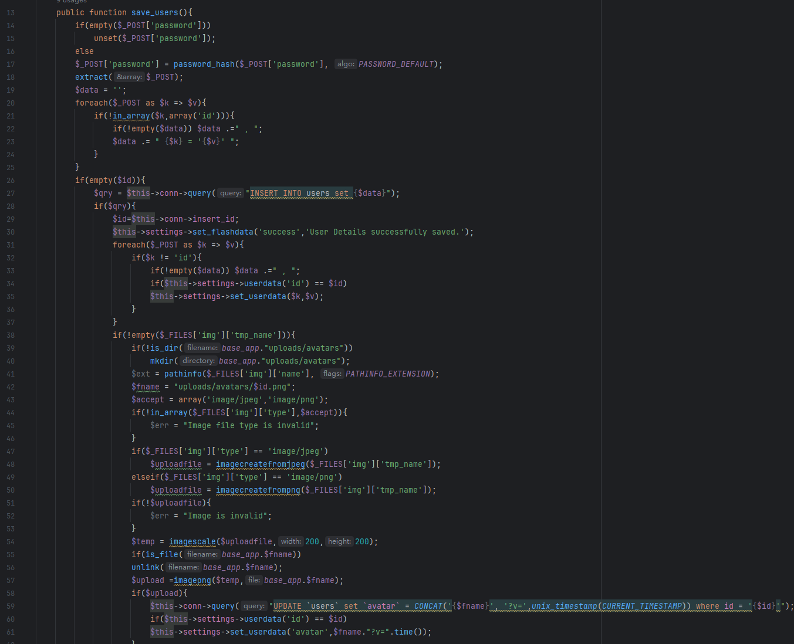
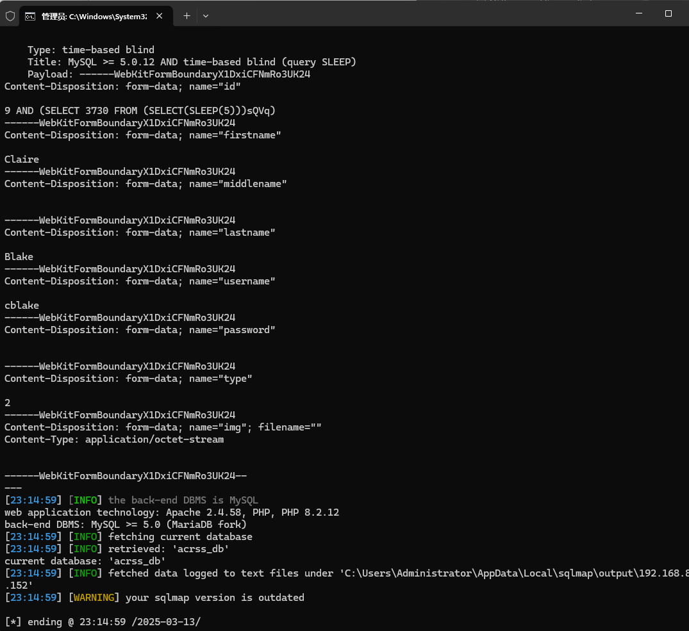

AC Repair and Services System using SQL injection vulnerabilities can be exploited by attackers to steal information or corrupt databases without authentication.


Source code address：https://www.sourcecodester.com/php/16513/ac-repair-and-services-system-using-php-and-mysql-source-code-free-download.html


The vulnerability is located in sava_users of the /classes/Users.php file. The parameters in the HTTP POST request are converted to independent variables by 'extract($_POST)'. In the judgment of line 26, when '$id' is empty, execute 'INSERT' statement to insert the field value in '$data' into the 'users' table. After successful insertion, obtain the self-increment ID of the new user through' $this->conn->insert_id '. And assign the value to '$id'. When you see the judgment in line 58, when the file upload function is used, the avatar and user id will be updated, and you can see that the id is directly spliced with SQL statements, that is, there are related problems.




漏洞验证：

```
POST /php-acrss/classes/Users.php?f=save HTTP/1.1
Host: 192.168.80.152
Content-Length: 864
X-Requested-With: XMLHttpRequest
User-Agent: Mozilla/5.0 (Windows NT 10.0; Win64; x64) AppleWebKit/537.36 (KHTML, like Gecko) Chrome/133.0.0.0 Safari/537.36
Accept: */*
Content-Type: multipart/form-data; boundary=----WebKitFormBoundaryX1DxiCFNmRo3UK24
Accept-Encoding: gzip, deflate, br
Accept-Language: zh-CN,zh;q=0.9
Connection: keep-alive

------WebKitFormBoundaryX1DxiCFNmRo3UK24
Content-Disposition: form-data; name="id"

9
------WebKitFormBoundaryX1DxiCFNmRo3UK24
Content-Disposition: form-data; name="firstname"

Claire
------WebKitFormBoundaryX1DxiCFNmRo3UK24
Content-Disposition: form-data; name="middlename"


------WebKitFormBoundaryX1DxiCFNmRo3UK24
Content-Disposition: form-data; name="lastname"

Blake
------WebKitFormBoundaryX1DxiCFNmRo3UK24
Content-Disposition: form-data; name="username"

cblake
------WebKitFormBoundaryX1DxiCFNmRo3UK24
Content-Disposition: form-data; name="password"


------WebKitFormBoundaryX1DxiCFNmRo3UK24
Content-Disposition: form-data; name="type"

2
------WebKitFormBoundaryX1DxiCFNmRo3UK24
Content-Disposition: form-data; name="img"; filename=""
Content-Type: application/octet-stream


------WebKitFormBoundaryX1DxiCFNmRo3UK24--

```




