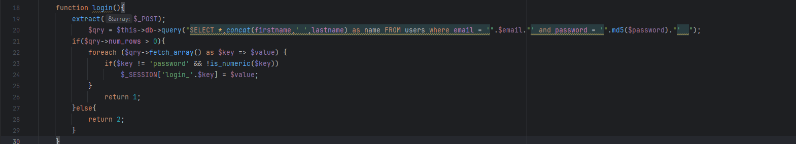
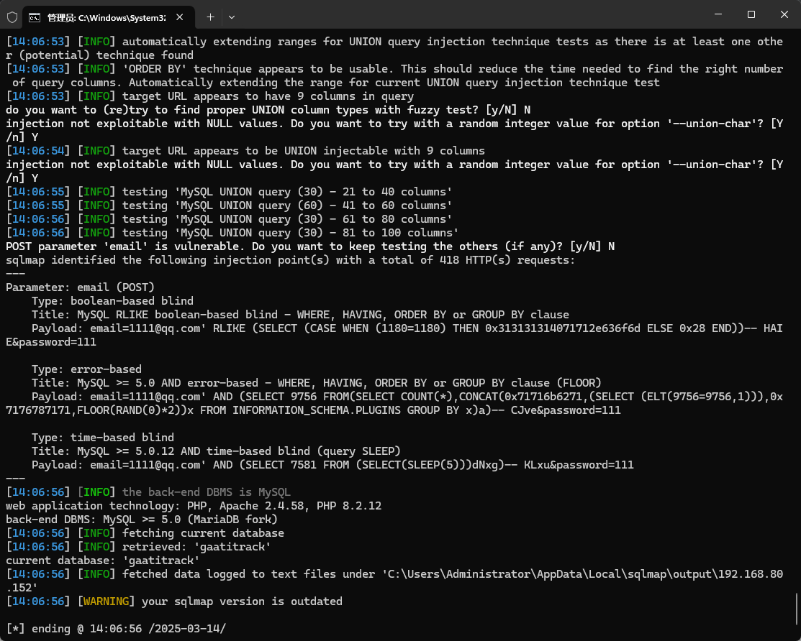

The Best courier management system has an SQL injection vulnerability that could be exploited by an attacker to steal information or compromise a database without authentication.


Source code address：https://www.sourcecodester.com/php/16848/best-courier-management-system-project-php.html


The vulnerability is located in the admin_class.php file, from the 19 line can be seen to receive the submitted POST request, and then query the database whether there are relevant parameters, there is no restriction, directly with the SQL statement stitching, there is a security risk.




Vulnerability verification：

```
POST /courier/ajax.php?action=login HTTP/1.1
Host: 192.168.80.152
User-Agent: Mozilla/5.0 (Windows NT 10.0; WOW64; rv:46.0) Gecko/20100101 Firefox/46.0
Accept: */*
Accept-Language: zh-CN,zh;q=0.8,en-US;q=0.5,en;q=0.3
Accept-Encoding: gzip, deflate, br
DNT: 1
Content-Type: application/x-www-form-urlencoded; charset=UTF-8
X-Requested-With: XMLHttpRequest
Referer: http://192.168.80.152/courier/login.php
Content-Length: 32
Connection: keep-alive

email=1111%40qq.com&password=111
```




