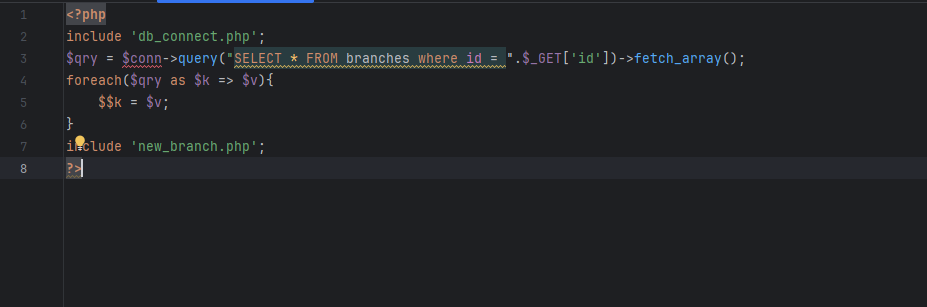
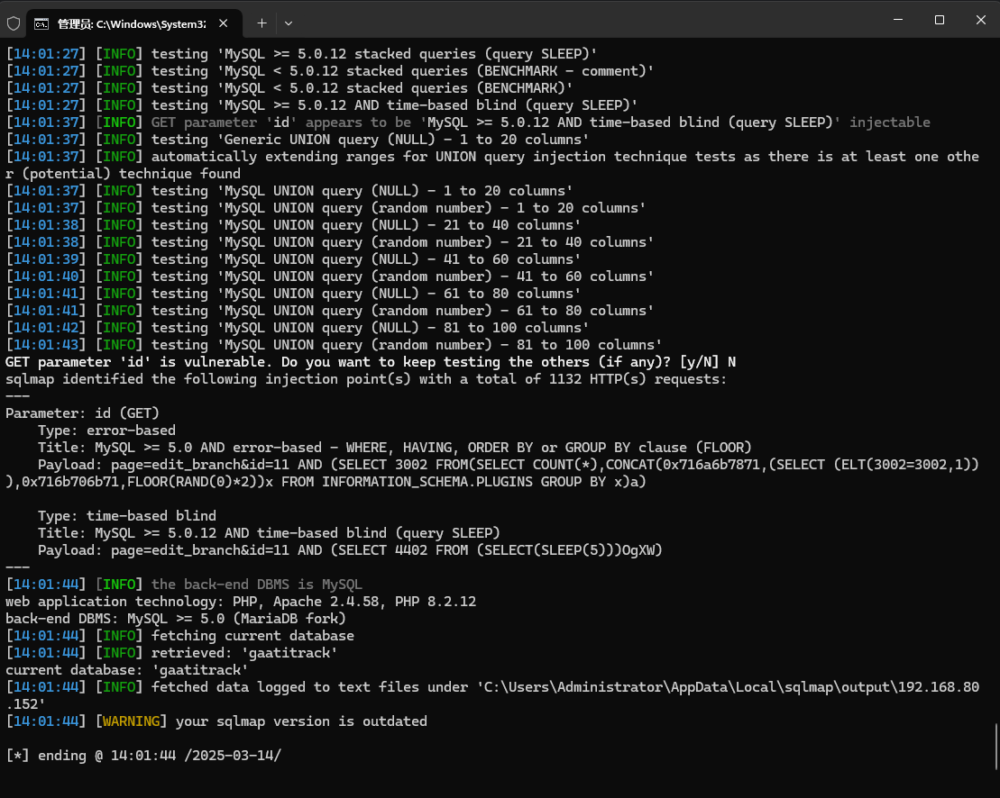

The Best courier management system has an SQL injection vulnerability that could be exploited by an attacker to steal information or compromise a database without authentication.


Source code address：https://www.sourcecodester.com/php/16848/best-courier-management-system-project-php.html


The vulnerability is located in the edit_branch.php file, which directly receives the submitted GET request information and concatenates it directly with the SQL statement. There is no restriction here, and there is a security risk.




Vulnerability verification：

```
GET /courier/index.php?page=edit_branch&id=11 HTTP/1.1
Host: 192.168.80.152
Upgrade-Insecure-Requests: 1
User-Agent: Mozilla/5.0 (Windows NT 10.0; Win64; x64) AppleWebKit/537.36 (KHTML, like Gecko) Chrome/100.0.4896.60 Safari/537.36
Accept: text/html,application/xhtml+xml,application/xml;q=0.9,image/avif,image/webp,image/apng,*/*;q=0.8,application/signed-exchange;v=b3;q=0.9
Accept-Encoding: gzip, deflate
Accept-Language: zh-CN,zh;q=0.9
Connection: close


```




