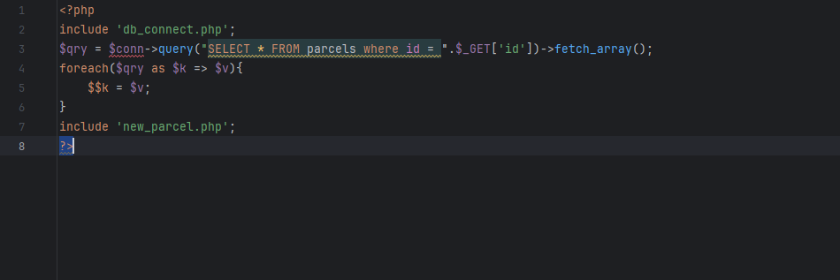
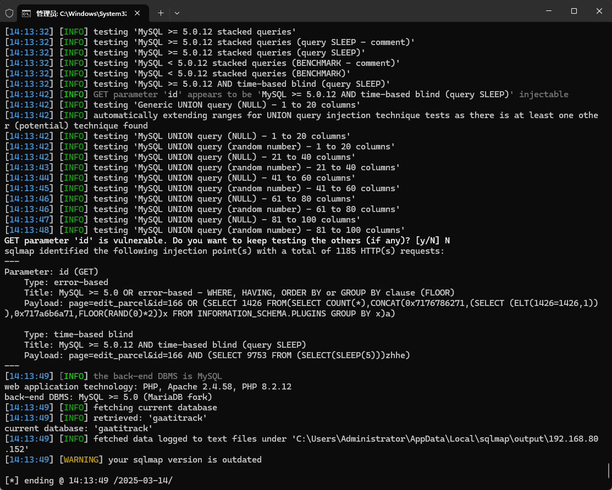

The Best courier management system has an SQL injection vulnerability that could be exploited by an attacker to steal information or compromise a database without authentication.


Source code address：https://www.sourcecodester.com/php/16848/best-courier-management-system-project-php.html


The vulnerability is located in the edit_parcel.php file, you can see that the third line of code directly receives the submitted GET request information and directly concatenates with the SQL statement, there is no restriction here, there is a security risk.




Vulnerability verification：

```
GET /courier/index.php?page=edit_parcel&id=166 HTTP/1.1
Host: 192.168.80.152
User-Agent: Mozilla/5.0 (Windows NT 10.0; WOW64; rv:46.0) Gecko/20100101 Firefox/46.0
Accept: text/html,application/xhtml+xml,application/xml;q=0.9,*/*;q=0.8
Accept-Language: zh-CN,zh;q=0.8,en-US;q=0.5,en;q=0.3
Accept-Encoding: gzip, deflate, br
DNT: 1
Connection: keep-alive


```




