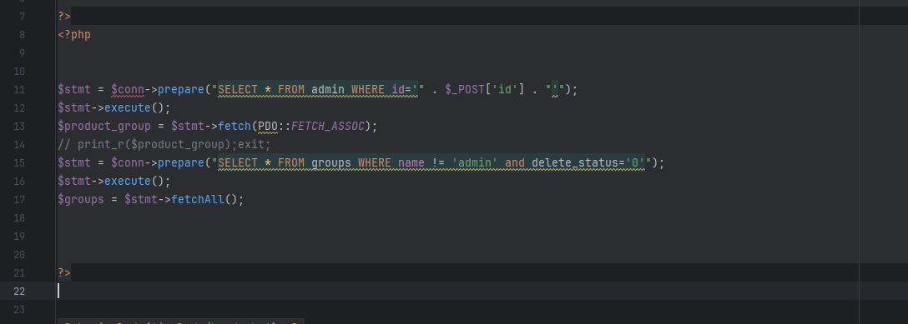
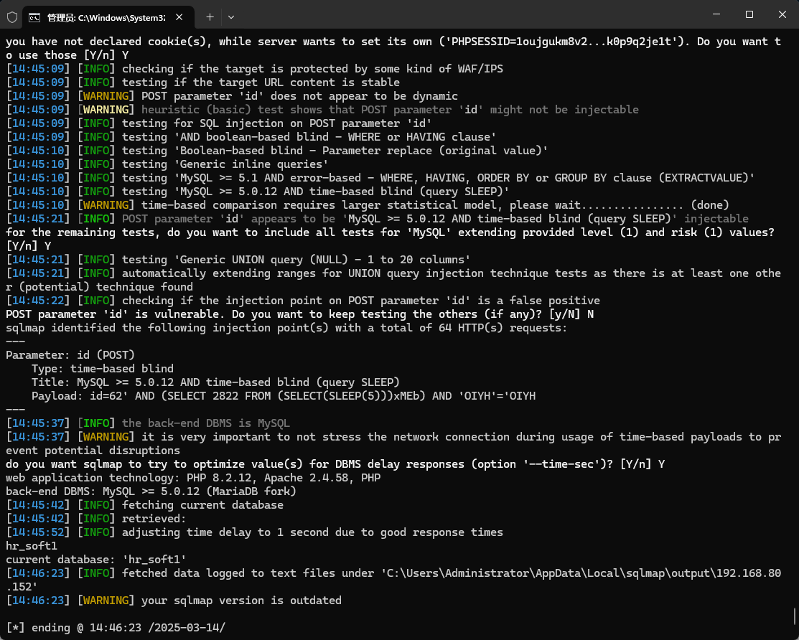

The Best employee management system has an SQL injection vulnerability that can be exploited by an attacker to steal information or corrupt a database without authentication.


Source code address：https://www.sourcecodester.com/php/17689/best-employee-management-system-php.html


The vulnerability is located in the admin/Update_User.php file, receives the id parameter of the submitted POST request, and directly concatenates it with the SQL statement, which has potential security risks.




Vulnerability verification：

```
POST /employee/admin/Update_User.php HTTP/1.1
Host: 192.168.80.152
User-Agent: Mozilla/5.0 (Windows NT 10.0; WOW64; rv:46.0) Gecko/20100101 Firefox/46.0
Accept: text/html,application/xhtml+xml,application/xml;q=0.9,*/*;q=0.8
Accept-Language: zh-CN,zh;q=0.8,en-US;q=0.5,en;q=0.3
Accept-Encoding: gzip, deflate, br
DNT: 1
Connection: keep-alive
Content-Type: application/x-www-form-urlencoded
Content-Length: 5

id=62
```




