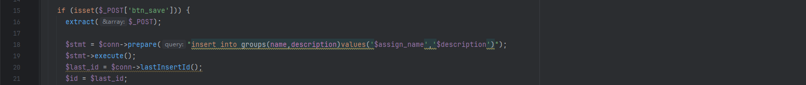
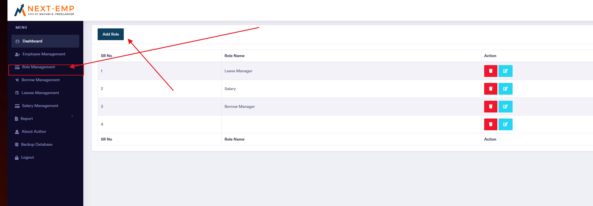
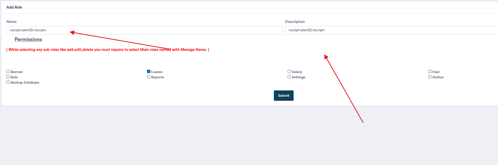
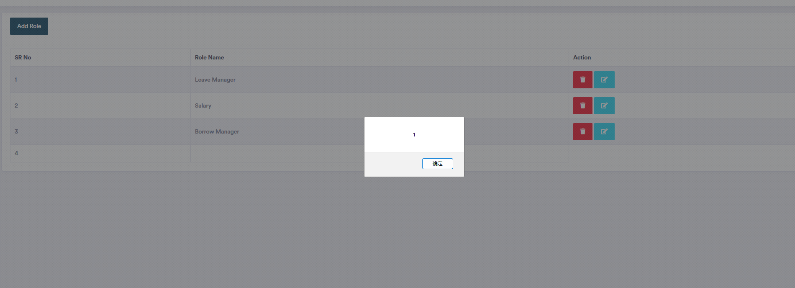
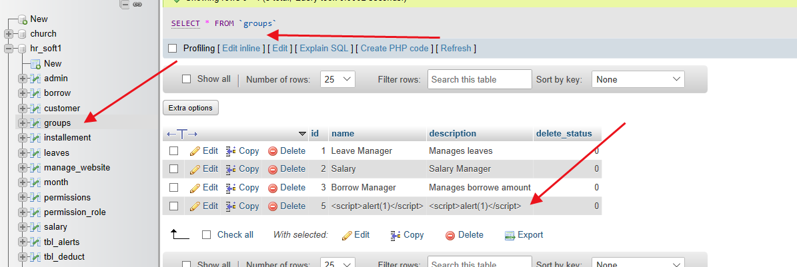

The Best Employee Management System has a stored-type xss vulnerability that could be exploited by an attacker to write malicious xss to the database while being authenticated, affecting system functionality.


Source code address：https://www.sourcecodester.com/php/17689/best-employee-management-system-php.html


Loopholes in the/admin/Operation/Role. PHP file, direct look at the key code, the code directly to the user input assign_name and description spliced into SQL statements written to the groups in the table.




Vulnerability verification：

payload：

```
<script>alert(1)</script>
```










