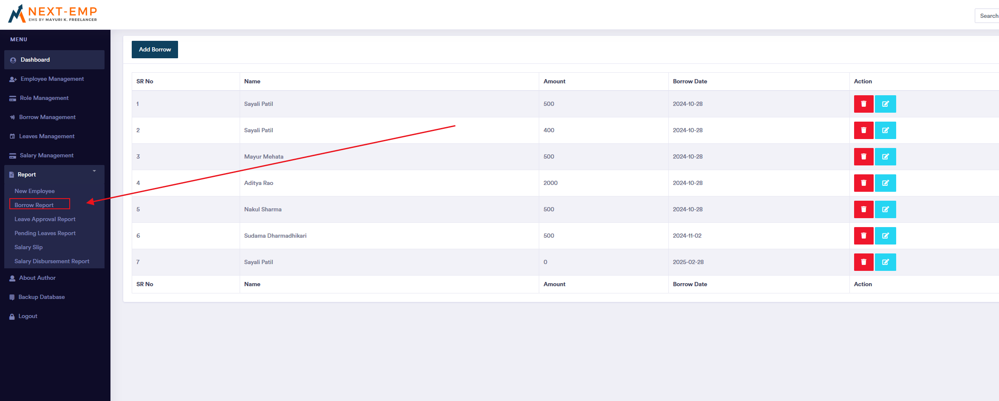

The Best Employee Management System has a stored-type xss vulnerability that could be exploited by an attacker to write malicious xss to the database while being authenticated, affecting system functionality.


Source code address：https://www.sourcecodester.com/php/17689/best-employee-management-system-php.html


Loopholes in the/admin/Operation/borrow. PHP file, direct look at the key code, other parameters are fixed format need to input content in the front end, but a tiny field belongs to the text field, and do not make filtering and restriction, when performing btn_save saved will write directly to borrow in the table.


Vulnerability verification：

payload：

```
<script>alert(2)</script>
```


Click again




