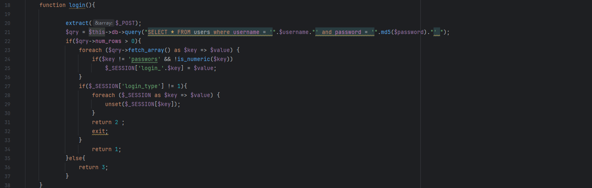
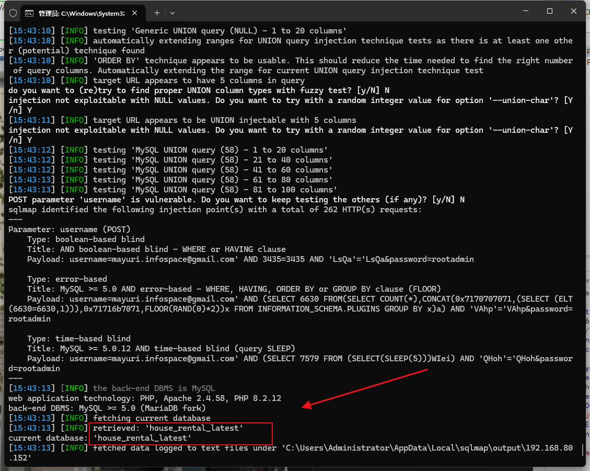

The Best house rental management system has an SQL injection vulnerability that could be exploited by an attacker to steal information or compromise a database without authentication.


Source code address：https://www.sourcecodester.com/php/17375/best-courier-management-system-project-php.html


The vulnerability is located in the /rental/admin_class.php file, the code receives the parameters of the POST request, and then directly into the SQL statement to execute, without any protection, username parameter has security risks.




Vulnerability verification：

```
POST /house/rental/ajax.php?action=login HTTP/1.1
Host: 192.168.80.152
User-Agent: Mozilla/5.0 (Windows NT 10.0; WOW64; rv:46.0) Gecko/20100101 Firefox/46.0
Accept: */*
Accept-Language: zh-CN,zh;q=0.8,en-US;q=0.5,en;q=0.3
Accept-Encoding: gzip, deflate, br
DNT: 1
Content-Type: application/x-www-form-urlencoded; charset=UTF-8
X-Requested-With: XMLHttpRequest
Referer: http://192.168.80.152/house/rental/login.php
Content-Length: 56
Connection: keep-alive

username=mayuri.infospace%40gmail.com&password=rootadmin
```

 


