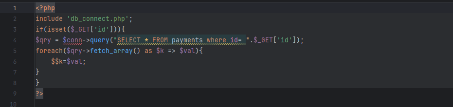
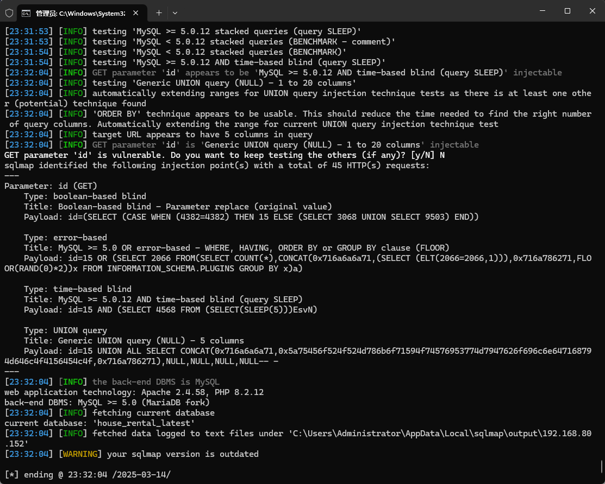

The Best house rental management system has an SQL injection vulnerability that could be exploited by an attacker to steal information or compromise a database without authentication.


Source code address：https://www.sourcecodester.com/php/17375/best-courier-management-system-project-php.html


The vulnerability is located in the /rental/manage_payment.php file. The parameters of the code receiving the GET request are then directly carried into the SQL statement for execution without any prevention. The id parameter has security risks.




Vulnerability verification：

```
GET /house/rental/manage_payment.php?id=15 HTTP/1.1
Host: 192.168.80.152
User-Agent: Mozilla/5.0 (Windows NT 10.0; WOW64; rv:46.0) Gecko/20100101 Firefox/46.0
Accept: */*
Accept-Language: zh-CN,zh;q=0.8,en-US;q=0.5,en;q=0.3
Accept-Encoding: gzip, deflate, br
DNT: 1
X-Requested-With: XMLHttpRequest
Connection: keep-alive


```

 


