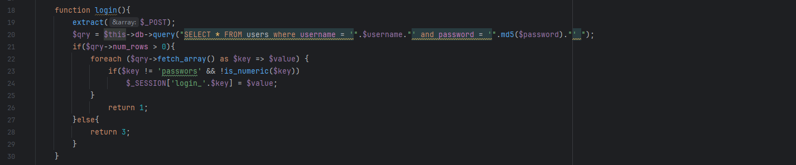
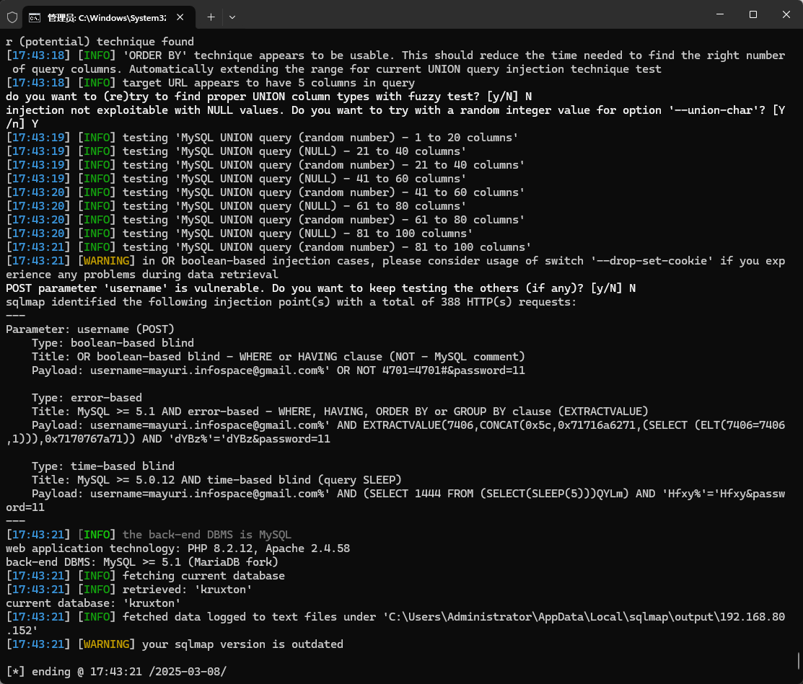

The Best pos management system has an SQL injection vulnerability that can be exploited by an attacker to steal information or corrupt a database without authentication.


Source code address：https://www.sourcecodester.com/php/16127/best-pos-management-system-php.html


The vulnerability is located in the /kruxton/admin_class.php file, the code receives the parameters of the POST request, and then directly into the SQL statement to execute, without any prevention, the username parameter has security risks.




Vulnerability verification：

```
POST /kruxton/kruxton/ajax.php?action=login HTTP/1.1
Host: 192.168.80.152
Content-Length: 49
Accept: */*
X-Requested-With: XMLHttpRequest
User-Agent: Mozilla/5.0 (Windows NT 10.0; Win64; x64) AppleWebKit/537.36 (KHTML, like Gecko) Chrome/100.0.4896.60 Safari/537.36
Content-Type: application/x-www-form-urlencoded; charset=UTF-8
Origin: http://192.168.80.152
Referer: http://192.168.80.152/kruxton/kruxton/login.php
Accept-Encoding: gzip, deflate
Accept-Language: zh-CN,zh;q=0.9
Connection: close

username=mayuri.infospace%40gmail.com&password=11
```

 


