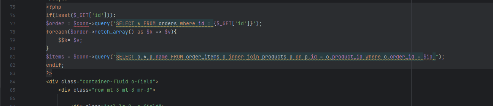
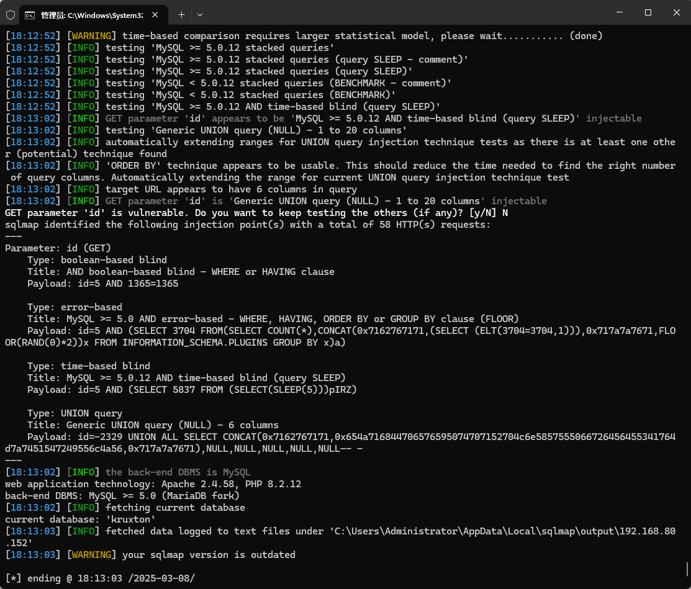

The Best pos management system has an SQL injection vulnerability that can be exploited by an attacker to steal information or corrupt a database without authentication.


Source code address：https://www.sourcecodester.com/php/16127/best-pos-management-system-php.html


Loopholes in the/kruxton/billing/home. PHP file, receive a GET request parameters in the code, and then directly into the SQL statement to execute, did not do anything to prevent, id parameter pose a safety hazard.




Vulnerability verification：

```
GET /kruxton/kruxton/billing/index.php?id=5 HTTP/1.1
Host: 192.168.80.152
Accept: */*
User-Agent: Mozilla/5.0 (Windows NT 10.0; Win64; x64) AppleWebKit/537.36 (KHTML, like Gecko) Chrome/100.0.4896.60 Safari/537.36
X-Requested-With: XMLHttpRequest
Accept-Encoding: gzip, deflate
Accept-Language: zh-CN,zh;q=0.9
Connection: close


```

 


