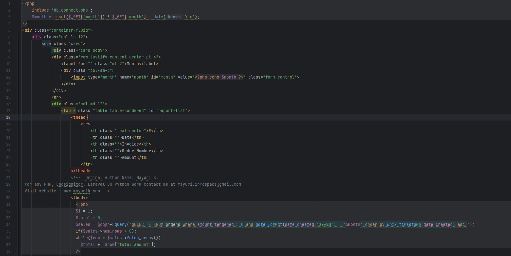
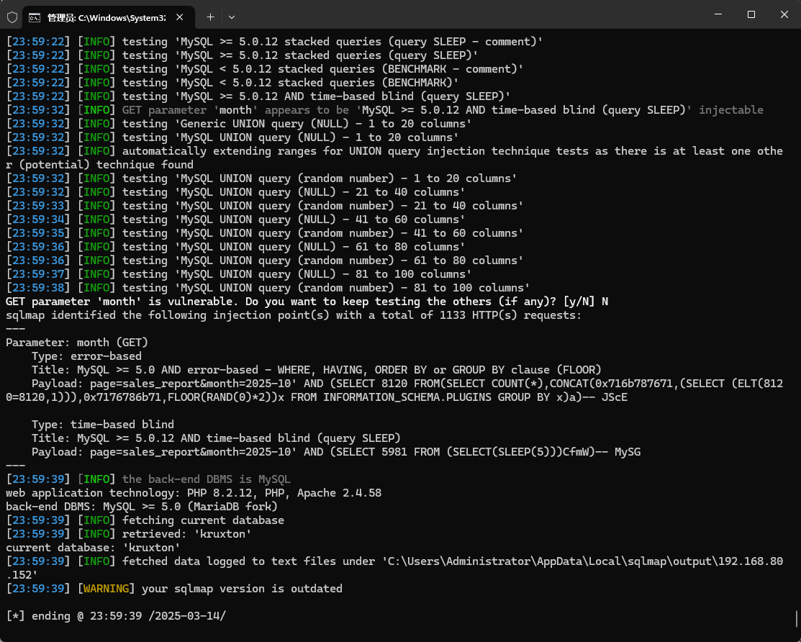

The Best pos management system has an SQL injection vulnerability that can be exploited by an attacker to steal information or corrupt a database without authentication.


Source code address：https://www.sourcecodester.com/php/16127/best-pos-management-system-php.html


The vulnerability is located in the /kruxton/sales_report.php file, the code receives the parameters of the GET request, and then directly into the SQL statement to execute, without any prevention, the month parameter has security risks.




Vulnerability verification：

```
GET /kruxton/kruxton/index.php?page=sales_report&month=2025-10 HTTP/1.1
Host: 192.168.80.152
Accept: */*
User-Agent: Mozilla/5.0 (Windows NT 10.0; Win64; x64) AppleWebKit/537.36 (KHTML, like Gecko) Chrome/100.0.4896.60 Safari/537.36
X-Requested-With: XMLHttpRequest
Accept-Encoding: gzip, deflate
Accept-Language: zh-CN,zh;q=0.9
Connection: close


```

 


