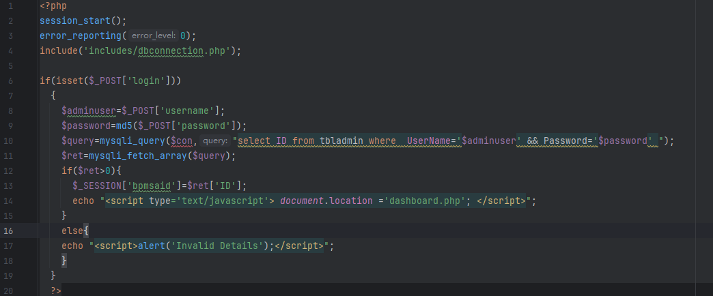
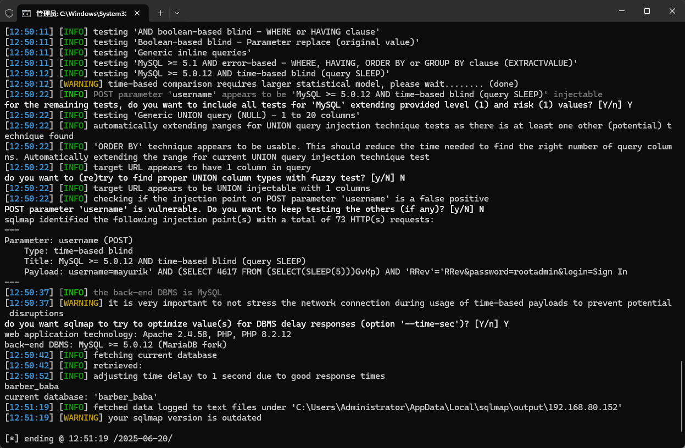

The Best salon management system has an SQL injection vulnerability. Attackers can exploit this vulnerability to steal information or damage the database without authentication.


Source code address：https://www.sourcecodester.com/php/18171/best-salon-management-system-project-php.html


Loopholes in barbarbaba/panel/index. The PHP file, receive the login request data in the code, and then into a database query, there is a direct and joining together of SQL statements, without too much limitation, pose a safety hazard.




Vulnerability verification：

```
POST /barbarbaba/panel/ HTTP/1.1
Host: 192.168.80.152
Content-Length: 49
Cache-Control: max-age=0
Upgrade-Insecure-Requests: 1
Content-Type: application/x-www-form-urlencoded
User-Agent: Mozilla/5.0 (Windows NT 10.0; Win64; x64) AppleWebKit/537.36 (KHTML, like Gecko) Chrome/100.0.4896.60 Safari/537.36
Accept: text/html,application/xhtml+xml,application/xml;q=0.9,image/avif,image/webp,image/apng,*/*;q=0.8,application/signed-exchange;v=b3;q=0.9
Accept-Encoding: gzip, deflate
Accept-Language: zh-CN,zh;q=0.9
Connection: close

username=mayurik&password=rootadmin&login=Sign+In
```

 


