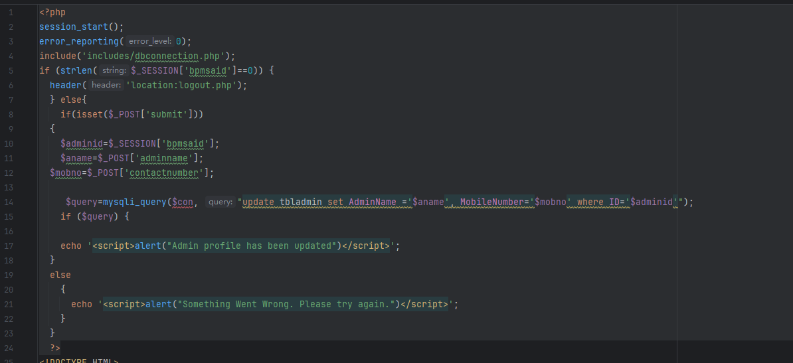
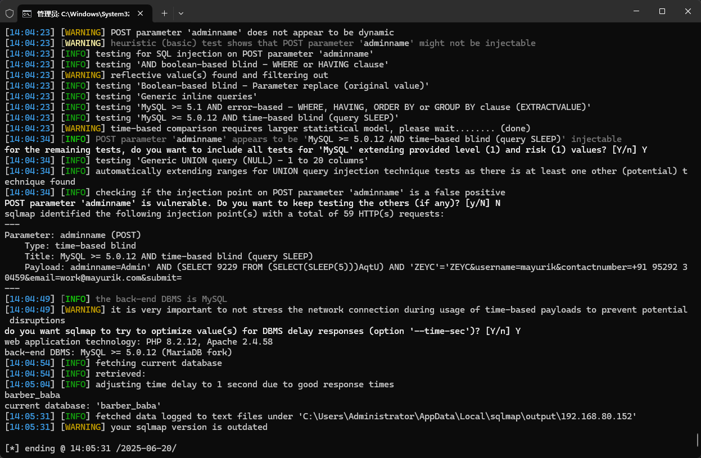

The Best salon management system has an SQL injection vulnerability. If an attacker is authenticated, they can exploit this vulnerability to steal information or damage the database.


Source code address：https://www.sourcecodester.com/php/18171/best-salon-management-system-project-php.html


The vulnerability is located in the barbarbaba/panel/admin-profile.php file. The code receives the data submitted by the user and then updates the information in the database. There is a direct concatenation with the SQL statement without too many restrictions, which poses a security risk.




Vulnerability verification：

```
POST /barbarbaba/panel/admin-profile.php HTTP/1.1
Host: 192.168.80.152
Content-Length: 97
Cache-Control: max-age=0
Upgrade-Insecure-Requests: 1
Origin: http://192.168.80.152
Content-Type: application/x-www-form-urlencoded
User-Agent: Mozilla/5.0 (Windows NT 10.0; Win64; x64) AppleWebKit/537.36 (KHTML, like Gecko) Chrome/100.0.4896.60 Safari/537.36
Accept: text/html,application/xhtml+xml,application/xml;q=0.9,image/avif,image/webp,image/apng,*/*;q=0.8,application/signed-exchange;v=b3;q=0.9
Referer: http://192.168.80.152/barbarbaba/panel/admin-profile.php
Accept-Encoding: gzip, deflate
Accept-Language: zh-CN,zh;q=0.9
Cookie: PHPSESSID=9qunanken3a3eh5ub3i2aegl9i
Connection: close

adminname=Admin&username=mayurik&contactnumber=%2B91+95292+30459&email=work%40mayurik.com&submit=
```

 


