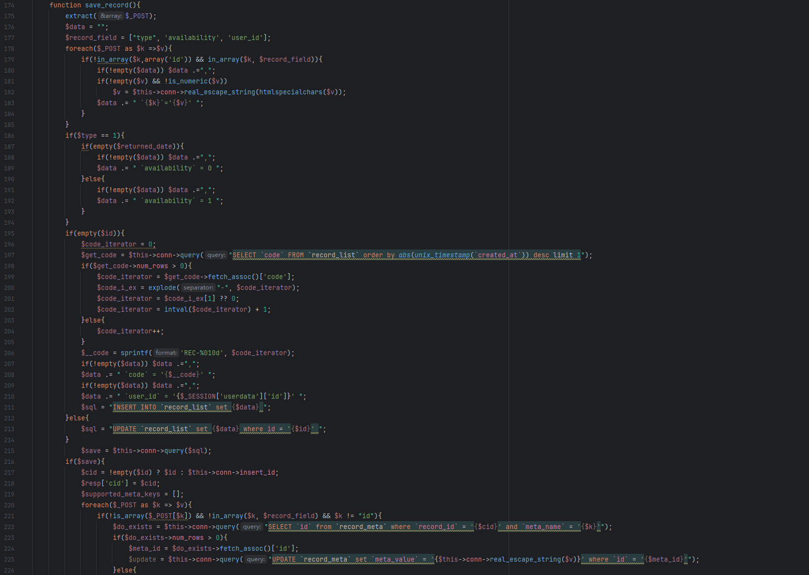
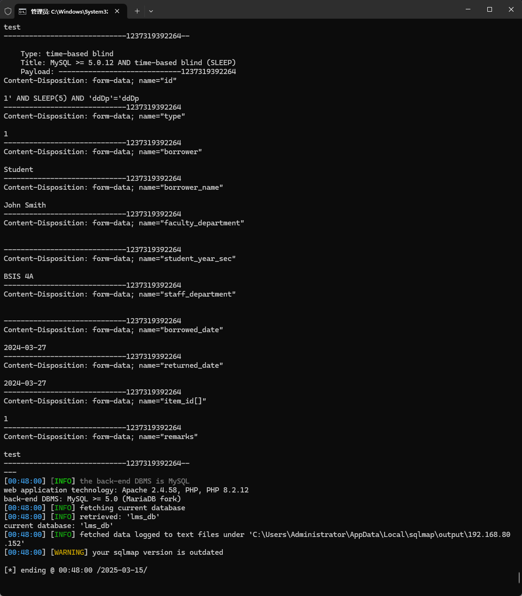

The Computer Laboratory Management System has an SQL injection vulnerability that could be exploited by an attacker to steal information or compromise a database without authentication.


Source code address：https://www.sourcecodester.com/php/17268/computer-laboratory-management-system-using-php-and-mysql.html


The vulnerability is located in the /classes/Users.php file, directly see save_record, locate to 195-215 lines of code, mainly according to whether there is a '$id' to determine whether to insert a new record or update the existing record, the SQL statement in line 213 is directly splice with $id, there is a security risk.




Vulnerability verification：

```
POST /php-lms/classes/Master.php?f=save_record HTTP/1.1
Host: 192.168.80.152
User-Agent: Mozilla/5.0 (Windows NT 10.0; WOW64; rv:46.0) Gecko/20100101 Firefox/46.0
Accept: application/json, text/javascript, */*; q=0.01
Accept-Language: zh-CN,zh;q=0.8,en-US;q=0.5,en;q=0.3
Accept-Encoding: gzip, deflate, br
DNT: 1
X-Requested-With: XMLHttpRequest
Content-Length: 1195
Content-Type: multipart/form-data; boundary=---------------------------1237319392264
Connection: keep-alive

-----------------------------1237319392264
Content-Disposition: form-data; name="id"

1
-----------------------------1237319392264
Content-Disposition: form-data; name="type"

1
-----------------------------1237319392264
Content-Disposition: form-data; name="borrower"

Student
-----------------------------1237319392264
Content-Disposition: form-data; name="borrower_name"

John Smith
-----------------------------1237319392264
Content-Disposition: form-data; name="faculty_department"


-----------------------------1237319392264
Content-Disposition: form-data; name="student_year_sec"

BSIS 4A
-----------------------------1237319392264
Content-Disposition: form-data; name="staff_department"


-----------------------------1237319392264
Content-Disposition: form-data; name="borrowed_date"

2024-03-27
-----------------------------1237319392264
Content-Disposition: form-data; name="returned_date"

2024-03-27
-----------------------------1237319392264
Content-Disposition: form-data; name="item_id[]"

1
-----------------------------1237319392264
Content-Disposition: form-data; name="remarks"

test
-----------------------------1237319392264--

```




