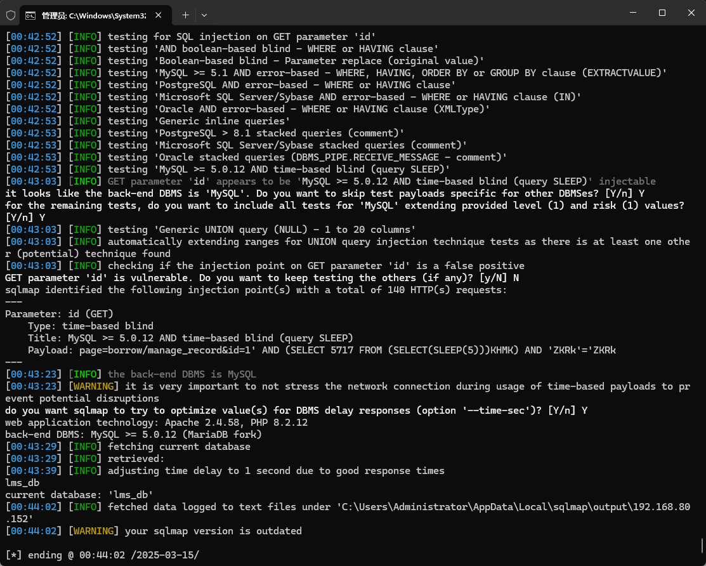

The Computer Laboratory Management System has an SQL injection vulnerability that could be exploited by an attacker to steal information or compromise a database without authentication.


Source code address：https://www.sourcecodester.com/php/17268/computer-laboratory-management-system-using-php-and-mysql.html


The vulnerability is located in the /admin/borrow/manage_record.php file. Check whether the id parameter in the received GET request is greater than 0. If so, go to the SQL statement to query related information.


Vulnerability verification：

```
GET /php-lms/admin/?page=borrow/manage_record&id=1 HTTP/1.1
Host: 192.168.80.152
User-Agent: Mozilla/5.0 (Windows NT 10.0; WOW64; rv:46.0) Gecko/20100101 Firefox/46.0
Accept: text/html,application/xhtml+xml,application/xml;q=0.9,*/*;q=0.8
Accept-Language: zh-CN,zh;q=0.8,en-US;q=0.5,en;q=0.3
Accept-Encoding: gzip, deflate, br
DNT: 1
Connection: keep-alive

```




