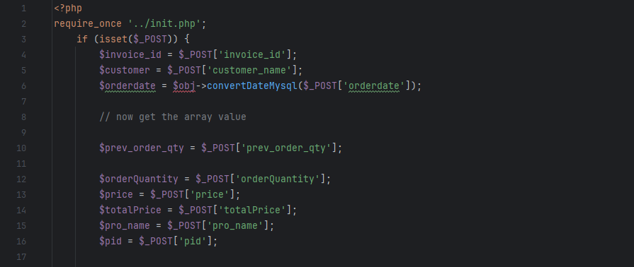
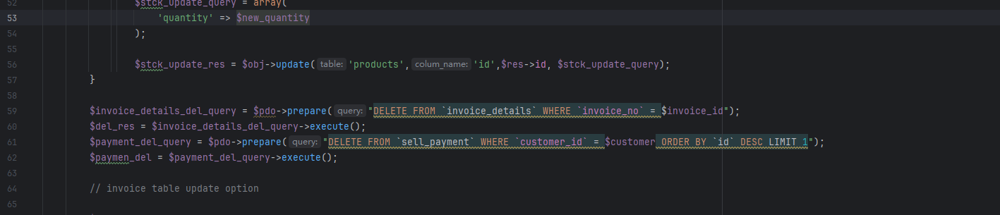
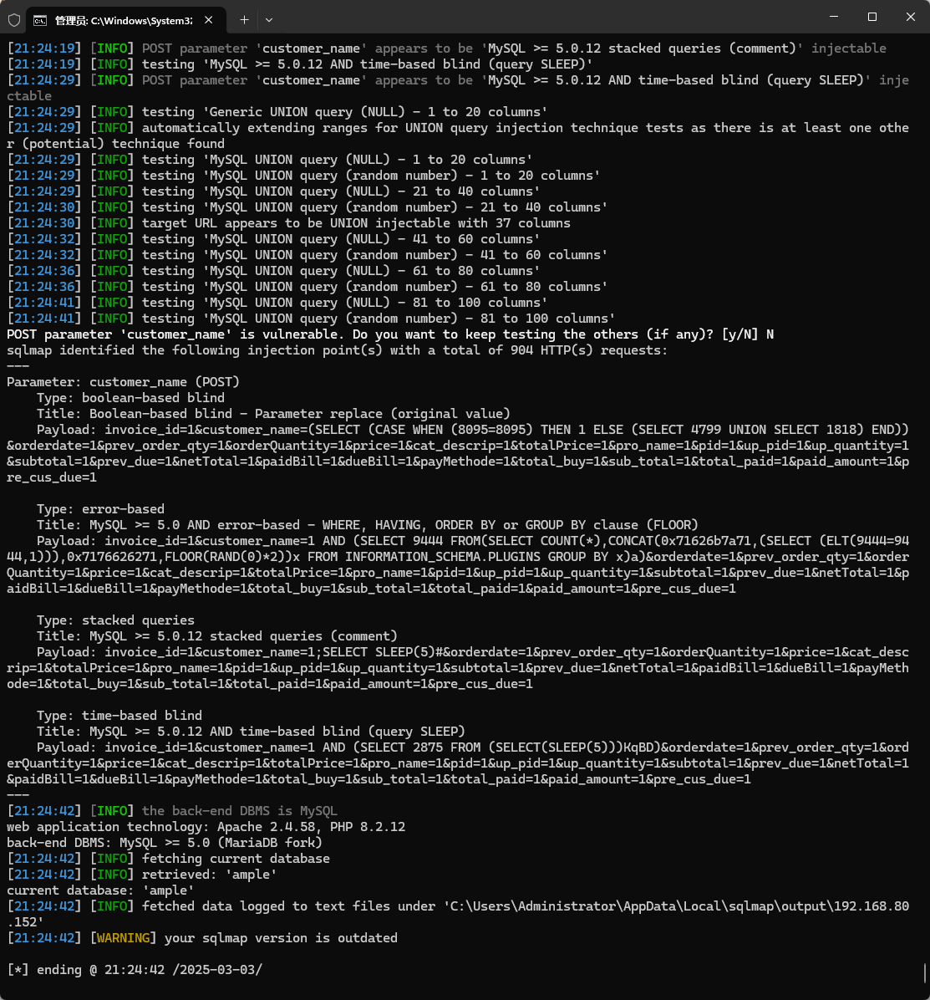

The Free and Open Source inventory management system has an SQL injection vulnerability that an attacker, if authenticated, can exploit to steal information or corrupt a database.


Source code address：https://www.sourcecodester.com/php/16741/free-and-open-source-inventory-management-system-php-source-code.html


The vulnerability is located in the /app/action/edit_sell.php file, and you can see the concatenation of SQL statements in the code snippet.







Vulnerability verification：

```
POST /ample/app/action/edit_sell.php HTTP/1.1
Host: 192.168.80.152
User-Agent: Mozilla/5.0 (Windows NT 10.0; WOW64; rv:46.0) Gecko/20100101 Firefox/46.0
Accept: text/html,application/xhtml+xml,application/xml;q=0.9,*/*;q=0.8
Accept-Language: zh-CN,zh;q=0.8,en-US;q=0.5,en;q=0.3
Accept-Encoding: gzip, deflate, br
DNT: 1
Cookie: PHPSESSID=c4gam437gl7cc6hlbsgm3pplq4
Connection: keep-alive
Content-Type: application/x-www-form-urlencoded
Content-Length: 280

invoice_id=1&customer_name=1&orderdate=1&prev_order_qty=1&orderQuantity=1&price=1&cat_descrip=1&totalPrice=1&pro_name=1&pid=1&up_pid=1&up_quantity=1&subtotal=1&prev_due=1&netTotal=1&paidBill=1&dueBill=1&payMethode=1&total_buy=1&sub_total=1&total_paid=1&paid_amount=1&pre_cus_due=1
```

 


