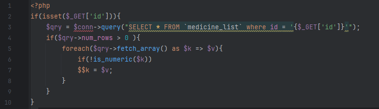

The Medicine Tracker System has an SQL injection vulnerability that could be exploited by an attacker to steal information or compromise a database without authentication.


Source code address：https://www.sourcecodester.com/php/16308/medicine-tracker-system-php-oop-and-mysql-db-source-code-free-download.html


The vulnerability is located in the /app/medicines/manage_medicine.php file, and the behavior of concatenating SQL statements with parameters can be seen in the code snippet.




Vulnerability verification：

```
GET /php-mts/app/?page=medicines/manage_medicine&id=1 HTTP/1.1
Host: 192.168.80.152
User-Agent: Mozilla/5.0 (Windows NT 10.0; WOW64; rv:46.0) Gecko/20100101 Firefox/46.0
Accept: text/html,application/xhtml+xml,application/xml;q=0.9,*/*;q=0.8
Accept-Language: zh-CN,zh;q=0.8,en-US;q=0.5,en;q=0.3
Accept-Encoding: gzip, deflate, br
DNT: 1
Connection: keep-alive


```

 


