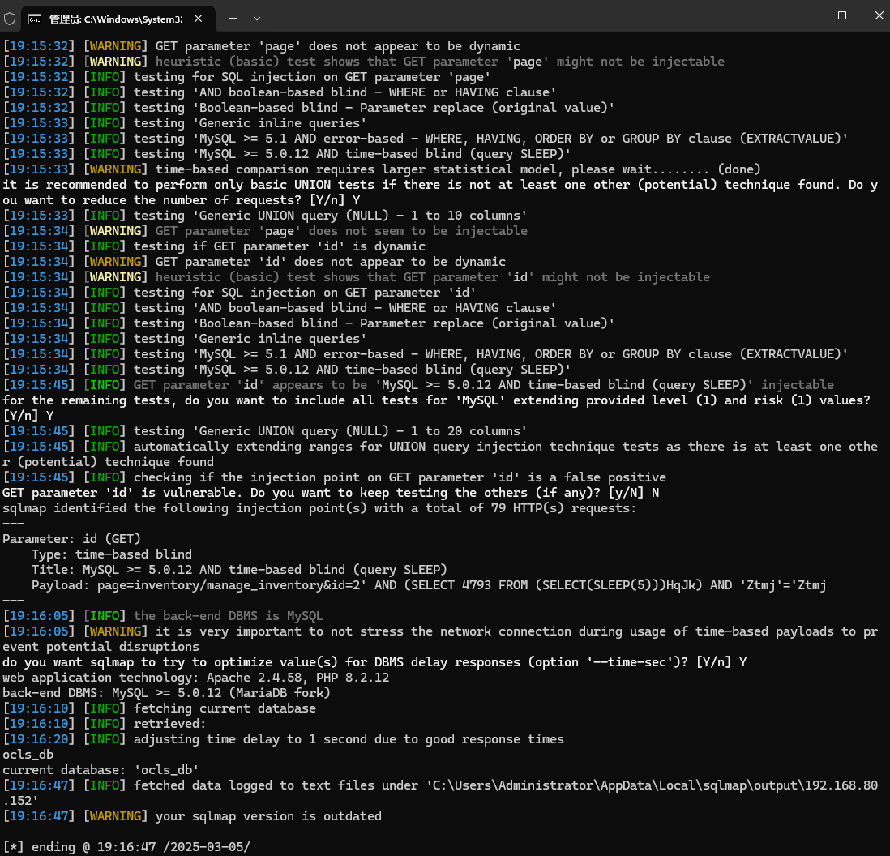

Online Computer and Laptop Store using an SQL injection vulnerability can be exploited by an attacker to steal information or compromise a database without authentication.


Source code address：https://www.sourcecodester.com/php/16397/online-computer-and-laptop-store-using-php-and-mysql-source-code-free-download.html


The vulnerability is located in the /admin/inventory/manage_inventory.php file, and you can see in the code snippet that the parameters passed in are directly concatenated with the SQL statement.


Vulnerability verification：

```
GET /php-ocls/admin/?page=inventory/manage_inventory&id=2 HTTP/1.1
Host: 192.168.80.152
User-Agent: Mozilla/5.0 (Windows NT 10.0; WOW64; rv:46.0) Gecko/20100101 Firefox/46.0
Accept: text/html,application/xhtml+xml,application/xml;q=0.9,*/*;q=0.8
Accept-Language: zh-CN,zh;q=0.8,en-US;q=0.5,en;q=0.3
Accept-Encoding: gzip, deflate, br
DNT: 1
Connection: keep-alive


```

 


