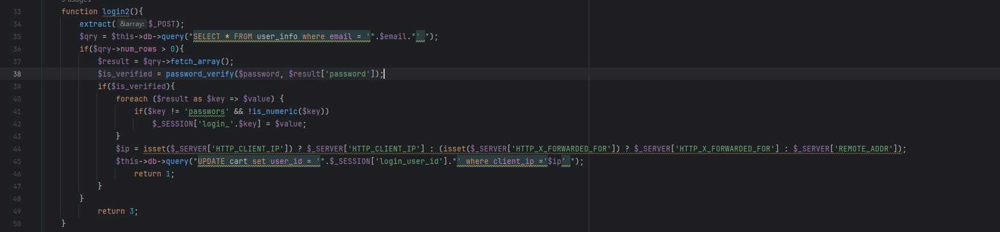
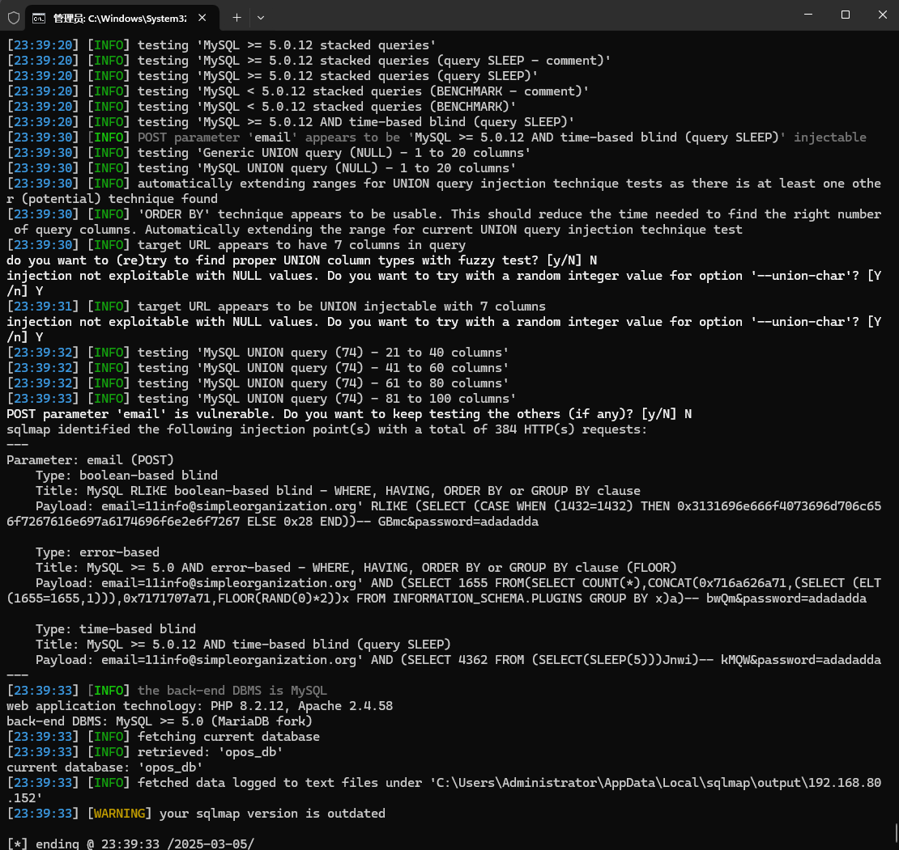

The Online Pizza Ordering System has an SQL injection vulnerability, which can be exploited by an attacker to steal information or corrupt a database without authentication.


Source code address：https://www.sourcecodester.com/php/16166/online-pizza-ordering-system-php-free-source-code.html


The vulnerability is located in login2 in the /admin/ajax.php file, and you can see in the code snippet that the parameters passed in are directly concatenated with the SQL statement.




Vulnerability verification：

```
POST /php-opos/admin/ajax.php?action=login2 HTTP/1.1
Host: 192.168.80.152
Content-Length: 55
X-Requested-With: XMLHttpRequest
User-Agent: Mozilla/5.0 (Windows NT 10.0; Win64; x64) AppleWebKit/537.36 (KHTML, like Gecko) Chrome/133.0.0.0 Safari/537.36
Accept: */*
Content-Type: application/x-www-form-urlencoded; charset=UTF-8
Origin: http://192.168.80.152
Referer: http://192.168.80.152/php-opos/index.php?page=about
Accept-Encoding: gzip, deflate, br
Accept-Language: zh-CN,zh;q=0.9
Cookie: PHPSESSID=ikn5f2ssfggorov7dk30r6ffap
Connection: keep-alive

email=11info%40simpleorganization.org&password=adadadda
```

 


