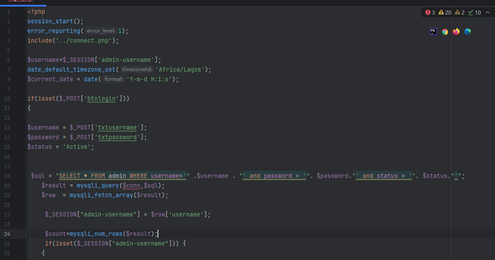
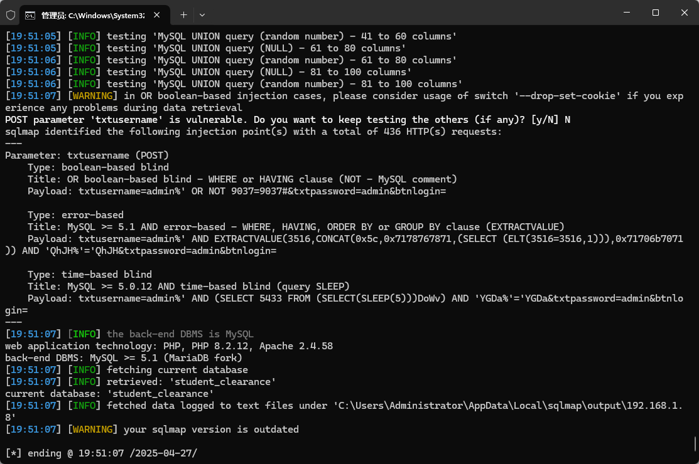

The Online Student Clearance System has an SQL injection vulnerability. Attackers can exploit this vulnerability to steal information or damage the database without authentication.


Source code address：https://www.sourcecodester.com/php/17892/online-clearance-system.html


The vulnerability is located in the /admin/login.php file. You can see the following code. After accepting the submitted username, it is directly imported into the database for execution. There are relevant security risks here.




Vulnerability verification：

```
POST /student_clearance/admin/login.php HTTP/1.1
Host: 192.168.1.8
Content-Length: 45
Cache-Control: max-age=0
Upgrade-Insecure-Requests: 1
Origin: http://192.168.1.8
Content-Type: application/x-www-form-urlencoded
User-Agent: Mozilla/5.0 (Windows NT 10.0; Win64; x64) AppleWebKit/537.36 (KHTML, like Gecko) Chrome/100.0.4896.60 Safari/537.36
Accept: text/html,application/xhtml+xml,application/xml;q=0.9,image/avif,image/webp,image/apng,*/*;q=0.8,application/signed-exchange;v=b3;q=0.9
Referer: http://192.168.1.8/student_clearance/admin/login.php
Accept-Encoding: gzip, deflate
Accept-Language: zh-CN,zh;q=0.9
Connection: close

txtusername=admin&txtpassword=admin&btnlogin=
```

 


