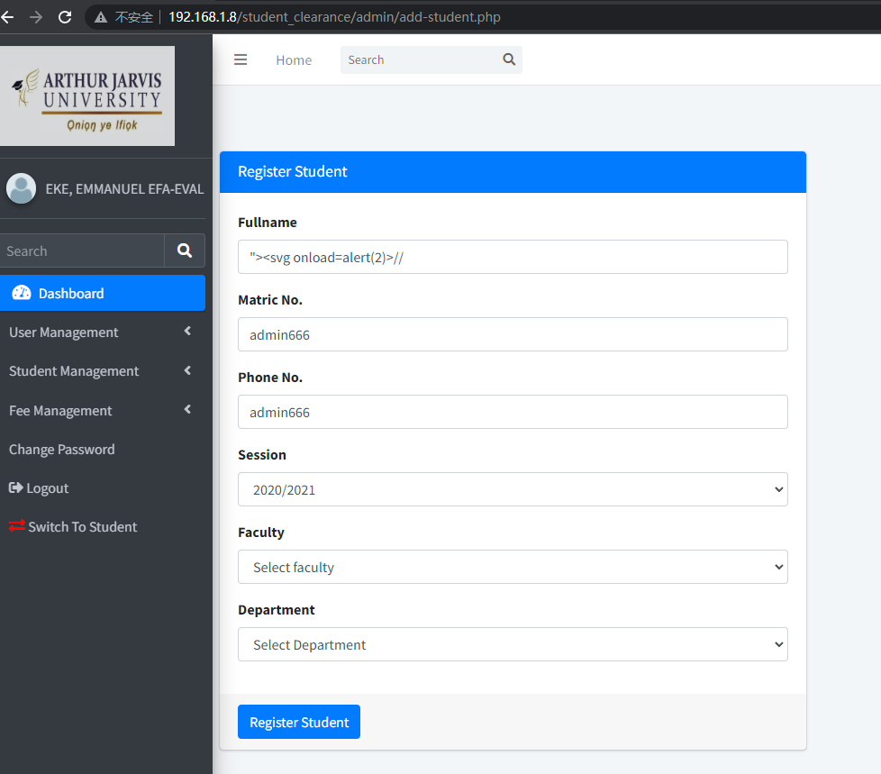
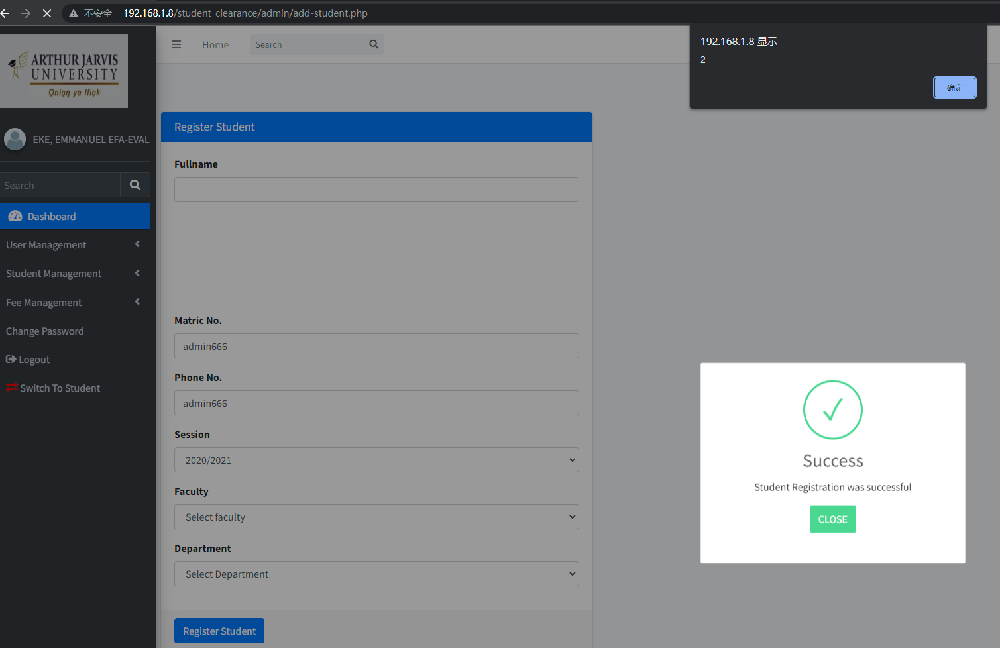

The Online Student Clearance System has an xss vulnerability. Attackers can exploit this vulnerability without authentication, thereby affecting the normal function.


Source code address：https://www.sourcecodester.com/php/17892/online-clearance-system.html


Vulnerability verification：

```
http://192.168.1.8:80/student_clearance/admin/add-student.php

"><svg onload=alert(2)>//
```

 


Insert payload："><svg onload=alert(2)>//




