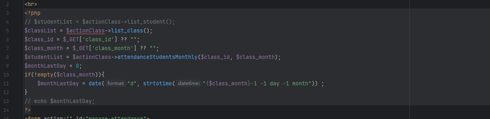
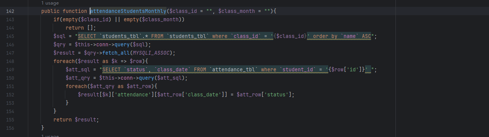
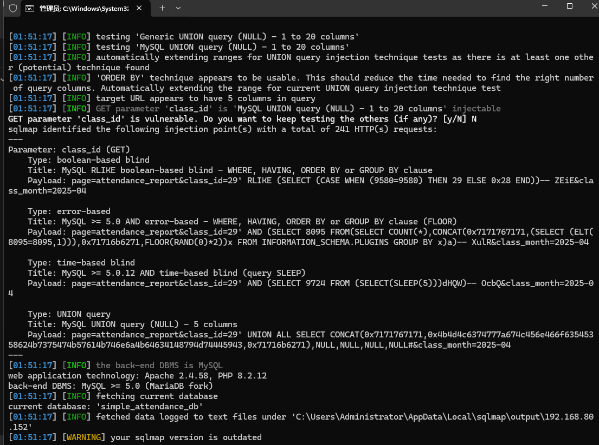

Simple Student Attendance System using SQL injection vulnerabilities exist that can be exploited by attackers to steal information or corrupt databases without authentication.


Source code address：https://www.sourcecodester.com/php/17018/simple-student-attendance-system-using-php-and-mysql.html


Loopholes in the/pages/attendance_report. PHP file, can see in the code snippets of the incoming parameters after dealing with the attendanceStudentsMonthly directly joining together with SQL statements.





Vulnerability verification：

```
GET /Student/?page=attendance_report&class_id=29&class_month=2025-04 HTTP/1.1
Host: 192.168.80.152
Upgrade-Insecure-Requests: 1
User-Agent: Mozilla/5.0 (Windows NT 10.0; Win64; x64) AppleWebKit/537.36 (KHTML, like Gecko) Chrome/124.0.0.0 Safari/537.36
Accept: text/html,application/xhtml+xml,application/xml;q=0.9,image/avif,image/webp,image/apng,*/*;q=0.8,application/signed-exchange;v=b3;q=0.7
Referer: http://192.168.80.152/Student/?page=attendance_report&class_id=29&class_month=
Accept-Encoding: gzip, deflate, br
Accept-Language: zh-CN,zh;q=0.9
Connection: keep-alive


```

 


