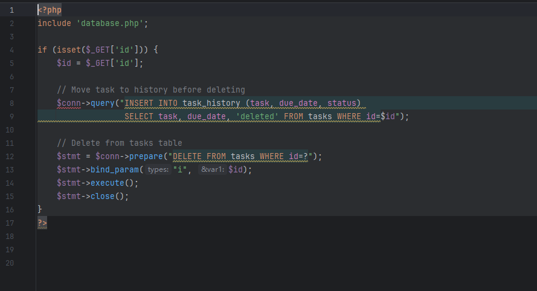

The Simple To-do List System has an SQL injection vulnerability. Attackers can exploit this vulnerability To steal information or damage the database without authentication.


Source code address：https://www.sourcecodester.com/php/17897/simple-do-list-system-using-php.html


The vulnerability is located in the delete_task.php file. It can be seen from the code that after receiving the id parameter, it will be brought into the SQL statement for concatenation without any restrictions, causing security problems.




Vulnerability verification：

```
GET /todolist/delete_task.php?id=8 HTTP/1.1
Host: 192.168.80.152
Accept: */*
User-Agent: Mozilla/5.0 (Windows NT 10.0; Win64; x64) AppleWebKit/537.36 (KHTML, like Gecko) Chrome/100.0.4896.60 Safari/537.36
X-Requested-With: XMLHttpRequest
Accept-Encoding: gzip, deflate
Accept-Language: zh-CN,zh;q=0.9
Connection: close
```

 


