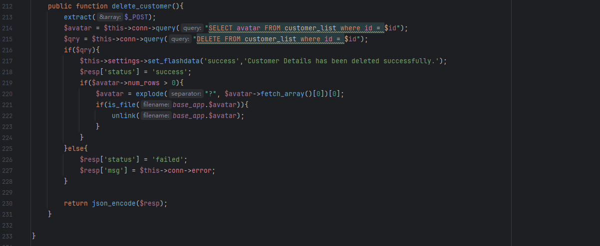
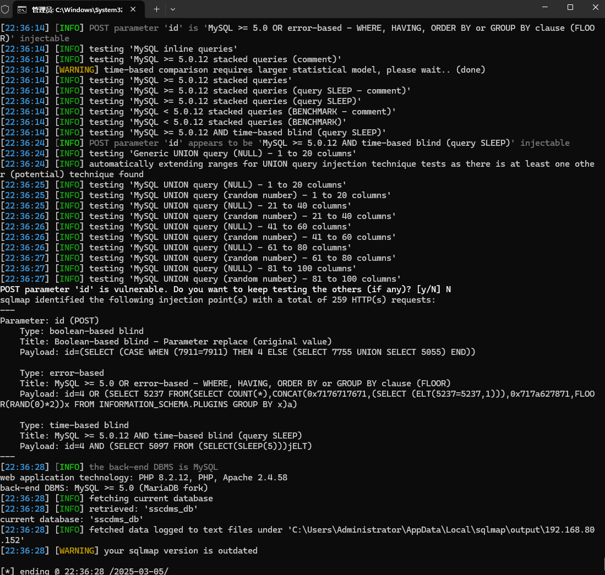

The Student Study Center Desk Management System has an SQL injection vulnerability that could be exploited by an attacker to steal information or corrupt a database without authentication.


Source code address：https://www.sourcecodester.com/php/16298/student-study-center-desk-management-system-using-php-oop-and-mysql-db-free-source-code


The vulnerability is located in the /classes/Users.php file, and the behavior of SQL statement concatenation can be seen in the code snippet.




Vulnerability verification：

```
POST /php-sscdms/classes/Users.php?f=delete HTTP/1.1
Host: 192.168.80.152
Content-Length: 4
X-Requested-With: XMLHttpRequest
User-Agent: Mozilla/5.0 (Windows NT 10.0; Win64; x64) AppleWebKit/537.36 (KHTML, like Gecko) Chrome/133.0.0.0 Safari/537.36
Accept: application/json, text/javascript, */*; q=0.01
Content-Type: application/x-www-form-urlencoded; charset=UTF-8
Accept-Encoding: gzip, deflate, br
Accept-Language: zh-CN,zh;q=0.9
Connection: keep-alive

id=4
```

 


