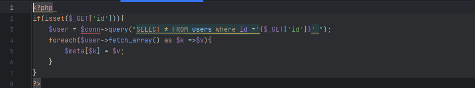
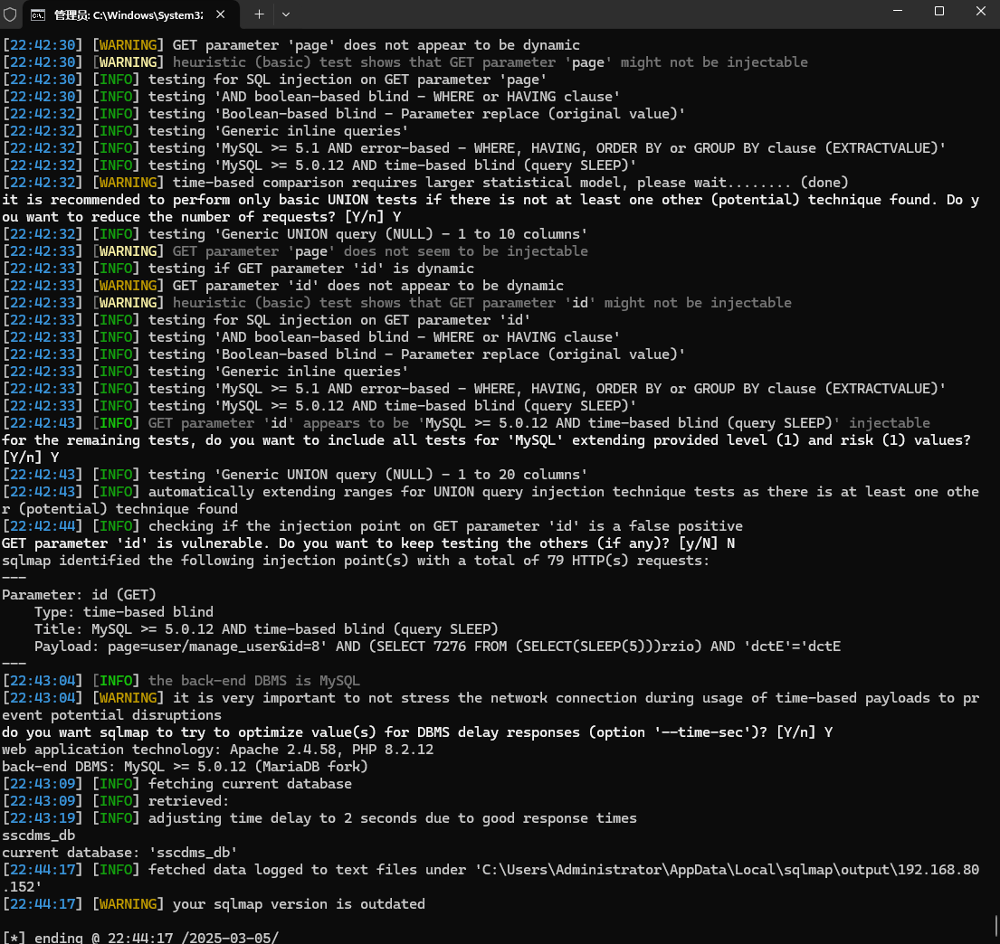

The Student Study Center Desk Management System has an SQL injection vulnerability that could be exploited by an attacker to steal information or corrupt a database without authentication.


Source code address：https://www.sourcecodester.com/php/16298/student-study-center-desk-management-system-using-php-oop-and-mysql-db-free-source-code


The vulnerability is located in the /admin/user/manage_user.php file, and you can see in the code snippet that the parameters passed in are directly concatenated with SQL statements.




Vulnerability verification：

```
GET /php-sscdms/admin/?page=user/manage_user&id=8 HTTP/1.1
Host: 192.168.80.152
User-Agent: Mozilla/5.0 (Windows NT 10.0; WOW64; rv:46.0) Gecko/20100101 Firefox/46.0
Accept: text/html,application/xhtml+xml,application/xml;q=0.9,*/*;q=0.8
Accept-Language: zh-CN,zh;q=0.8,en-US;q=0.5,en;q=0.3
Accept-Encoding: gzip, deflate, br
DNT: 1
Connection: keep-alive


```

 


