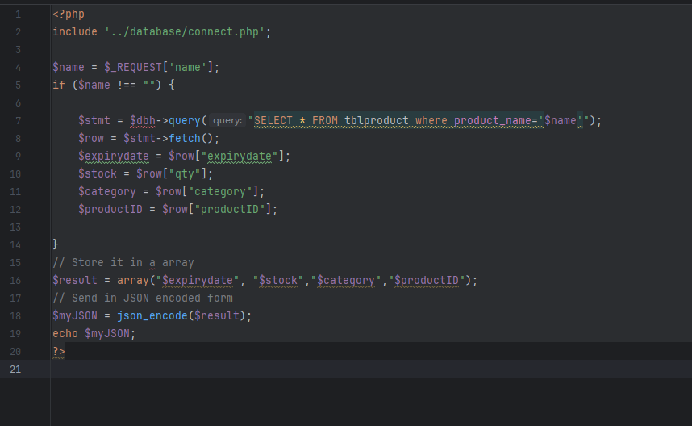
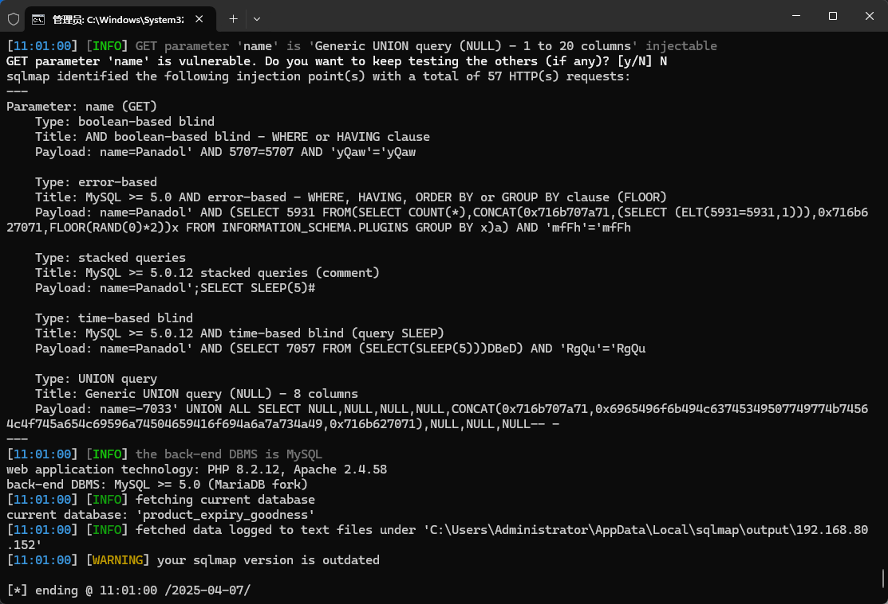

A Web-based Pharmacy Product Management System has an SQL injection vulnerability that could be exploited by an attacker to steal information or compromise a database without authentication.


Source code address：https://www.sourcecodester.com/php/17883/web-based-product-alert-system.html


The vulnerability is located in the /search/search_stock.php file, which determines that the name parameter is not empty and is carried into the SQL statement for concatenation query.




Vulnerability verification：

```
GET /product_expiry/search/search_stock.php?name=Panadol HTTP/1.1
Host: 192.168.80.152
User-Agent: Mozilla/5.0 (Windows NT 10.0; Win64; x64) AppleWebKit/537.36 (KHTML, like Gecko) Chrome/100.0.4896.60 Safari/537.36
Accept: */*
Accept-Encoding: gzip, deflate
Accept-Language: zh-CN,zh;q=0.9
Connection: close


```

 


